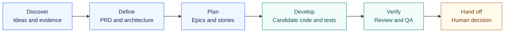

# DevForgeAI

### Specifications guide the work. Evidence supports the result. Humans own acceptance.

DevForgeAI is a spec-driven development framework under development for **Claude Code and Codex CLI**. Its design connects requirements, architecture, stories, bounded AI workers, deterministic checks, and explicit human handoffs.

This repository contains the design, 19 skill specifications, provider adapter sources, and runnable reference components. It is **not a complete, install-and-run framework release**. See [what is implemented and what has been observed](docs/evidence.md) before adopting it.

## Choose your path

| I want to… | Start here | What you will find |
| :--- | :--- | :--- |
| Evaluate the repository | [Getting started](docs/getting-started.md) | Prerequisites, local checks, and a scratch-only demo |
| Understand the workflow | [Skill roster](docs/skill-roster.md) | Visual lifecycle, responsibilities, artifacts, and all 19 specifications |
| Understand the safeguards | [Architecture](docs/architecture.md) | Context isolation, candidate roots, gates, receipts, and the DevForge trust boundary |
| Assess readiness | [Evidence and limits](docs/evidence.md) | Implemented components, version-bound observations, open gaps, and CI scope |

## The workflow at a glance

The design follows an artifact chain; each arrow below is a **human-directed handoff**, not an automatic invocation of the next skill.

[Explore the complete roster →](docs/skill-roster.md)

## What makes the design different

- **Thin entry points.** Provider adapters route a request; skills define the workflow; the sequencer controls transitions.
- **Bounded context.** Workers receive task-specific inputs. Stories carry relevant architecture excerpts and provenance hashes instead of the entire document set.
- **Explicit write authority.** Producers work in a fenced candidate root. Judges return findings; the sequencer records them and independently checks changes.
- **Evidence before acceptance.** A test pass, a live provider observation, and permission to promote a release are separate facts.

These are design contracts, not a claim of complete containment. The reference runtime remains project-local; protected enforcement belongs to the separate **DevForge** product. [Read the boundary and current limits →](docs/architecture.md#trust-boundary)

## Working on DevForgeAI

Use a dedicated topic worktree, preserve other sessions' changes, and keep `main` clean. Start with the [contributor checks](docs/getting-started.md#run-the-local-checks) and [repository guidelines](AGENTS.md).

For deeper work: [design overview](docs/design/00-overview.md) · [skill specifications](docs/design/specs/) · [research and checkpoint plan](docs/research/spec-driven-development-gap-closure/README.md) · [decision history](docs/CHECKPOINT.md).
