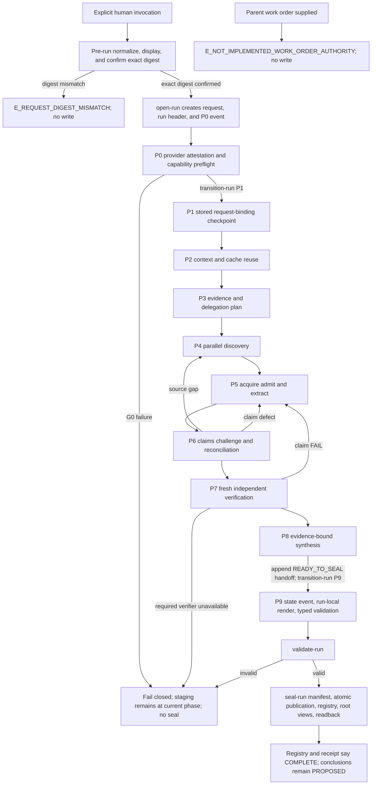

# Research P0-P9 workflow

This workflow is normative. `MUST`, `MUST NOT`, `REQUIRED`, and `MAY` are used
literally. A provider adapter may not weaken a gate.

## Invocation and persistence authority

The request schema accepts modes `STANDALONE`, `EMBEDDED`, `REFRESH`,
`CHALLENGE`, and `IMPACT`.

The current executable Core authorizes persistence only after an explicit human
invocation and confirmation of the exact normalized request digest. The request
schema reserves a digest-bound parent-work-order field, but `open-run` rejects
every request containing it with
`E_NOT_IMPLEMENTED_WORK_ORDER_AUTHORITY` before mutation.

The provider adapter must enforce explicit invocation. Implicit skill selection
or an ordinary request to "look into" something may produce an in-memory
advisory, but it MUST NOT call `open-run`, retain CAS bytes, or publish a claim.
The adapter source templates in this repository are not installed and have not
passed provider-runtime acceptance.

Until a deterministic request builder exists, each provider accepts only a
complete `research-request/v1` file. The executable provider forms are:

```text
Claude: /research <slug> --request <request-file> --confirm-request <sha256>

Codex:  $research <slug> --request <request-file> --confirm-request <sha256>
```

Before any search or canonical write, `normalize-request` canonicalizes the
request and returns its SHA-256 without creating a run. The adapter displays the
canonical request, scope, exclusions, budget, authorities, and digest, then
obtains confirmation of that exact digest. It supplies the confirmed digest to
`open-run`. A mismatch returns `E_REQUEST_DIGEST_MISMATCH` and performs no
write. Only after an exact match does `open-run` create the staging run and its
initial P0 state event.

## Required request fields

`research-request/v1` contains all of the following:

- requester, requesting phase, phase owner, decision authority, and confirming
  authority;
- entry mode, project ID, lowercase kebab-case dossier slug;
- atomic questions, intended downstream use, and linked artifact/decision IDs;
- supplied hypotheses labeled `UNVERIFIED_HYPOTHESIS`;
- included scope, excluded scope, and UTC `as_of` timestamp;
- risk tier: `LOW`, `MATERIAL`, or `CRITICAL`;
- required and prohibited source classes plus freshness requirements;
- existing Source, Claim, package, and context-manifest references with version
  and digest;
- budget profile and confirmed overrides;
- Research write fence and external-network policy;
- completion criteria, stop conditions, and escalation owner.

Missing fields are not inferred. `normalize-request` fails schema validation and
does not create a run; the adapter may present the reported missing or invalid
fields to the human, but it may not persist a fabricated request.

The source-class vocabulary accepted by Core is closed: required classes are
`PRIMARY` and/or `SECONDARY`; prohibited classes may additionally name
`SEARCH_SNIPPET`. Required and prohibited sets cannot overlap. Every question
plan and lane must retain the request's required classes, freshness requirement
strings, and stop-condition strings. Core enforces typed source admission and
freshness fields, plan binding, exact question coverage, and handoff
dispositions; it does not interpret free-text criteria as executable logic.
`reconciliation.question_coverage[].stop_conditions_met` is the reconciler's
explicit assertion and is retained as such, not described as independently
observed by Core.

The normalized `research-request/v1` includes the identity of the authority who
must confirm it. It excludes its own digest and the later confirmation act:
method, confirmation time, and supplied digest. Research Core computes the
digest over the finalized canonical request bytes, including the named
confirming authority.

After confirmation, `open-run` persists the exact confirmed bytes as
`request.json` without mutation and writes this separate binding in the
Core-owned `run.json` header:

```yaml
confirmation_binding:
  request_sha256: "64 lowercase hexadecimal characters"
  confirming_authority: "non-empty authority identifier"
  method: INTERACTIVE | WORK_ORDER
  confirmed_at: "UTC RFC 3339 timestamp"
  work_order_sha256: "64 lowercase hexadecimal characters" | null
```

The current executable path is `INTERACTIVE` with
`work_order_sha256: null`. Although the schema defines the `WORK_ORDER` shape,
Core rejects it before opening a run. The request digest is never recomputed
over `run.json`, the binding, or the digest itself.

## Budget profiles

| Limit | quick | standard | deep |
|---|---:|---:|---:|
| Atomic questions | 6 | 12 | 24 |
| Research lanes | 3 | 6 | 10 |
| Concurrent workers | 2 | 3 | 5 |
| Discovery queries | 30 | 60 | 150 |
| Admitted sources | 20 | 40 | 100 |
| External tool calls | 90 | 180 | 450 |
| Aggregate reported model tokens | 120,000 | 250,000 | 750,000 |
| Context bytes | 65,536 | 131,072 | 262,144 |
| Elapsed minutes | 45 | 90 | 240 |
| Retry per failed lane | 1 | 1 | 2 |

`standard` is the recommended profile when a human authors a complete request;
Core never fills an omitted profile. Limits aggregate the Research Lead and all
workers. Concurrency is a maximum, not a target. A caller may lower a limit
without an override. Every value above the selected profile must have exactly
one `confirmed_overrides` entry whose field and value match and whose
`authority_id` equals the request's named decision authority. An override at or
below the profile is invalid. No request may exceed the `deep` ceiling; the
current Core has no beyond-deep governance path.

When exact token usage is unavailable, the adapter uses a hard UTF-8
prompt-plus-response byte ceiling numerically equal to the token limit and
records `meter_mode=BYTE_PROXY`. It never labels that byte count measured
tokens.

The handoff's actual counters are bounded one-for-one by the confirmed limits:
`atomic_questions`, `research_lanes`, `discovery_queries`, `admitted_sources`,
`external_tool_calls`, `aggregate_model_tokens`, and `elapsed_minutes` use their
same-named limits; `context_bytes` is taken from the accepted context manifest
and uses the same-named limit; `concurrent_workers_peak` uses
`concurrent_workers`; and
`retries` uses `retry_per_failed_lane`. Core derives
question, query, admitted-source, and context-byte counts from canonical
records. Lane, concurrency, tool, token-or-byte, elapsed-time, and retry counts
must equal the accepted reconciliation record; a handoff cannot substitute
caller-reported values for those counters.

At a hard limit, the adapter starts no new query, retrieval, or worker. Core
also rejects canonical question, query, source, reconciliation, context, and
handoff counts that exceed their applicable confirmed limits. If stop
conditions remain unmet, the current run cannot seal. The adapter reports the
uncovered questions and exact requested increment to the named owner; any
increase requires a newly normalized and confirmed request because the current
request is immutable.

## State machine



Every completed phase appends and fsyncs a state event through Research Core.
Conversation history is never workflow state.

The current Core permits caller records only in these phases:

| Phase | Caller-submitted records |
|---|---|
| P0 | `provider-conformance.json`, then `preflight.json` |
| P1 | `decisions.jsonl` entries only |
| P2 | `questions.jsonl`, `decisions.jsonl`, then `context-manifest.json` |
| P3 | `decisions.jsonl`, then `plan.json` |
| P4 | `queries.jsonl` and `decisions.jsonl` |
| P5 | `sources.jsonl`, `evidence.jsonl`, and `decisions.jsonl`; retained bytes enter CAS only through `put-source` |
| P6 | `claims.jsonl`, `contradictions.jsonl`, `decisions.jsonl`, then `reconciliation.json` |
| P7 | `verifications.jsonl` and `decisions.jsonl`; Core builds verification packets during the P6-to-P7 transition |
| P8 | `synthesis.jsonl`, `handoff.json`, and `decisions.jsonl` |
| P9 | No caller records; Core owns the state event, run-local views, and `validation.json` |

Singleton records cannot be replaced. A correction before P9 requires a new
record where the schema and phase allow one, a legal repair transition, or a
new run. P9 and sealed runs are immutable.

## P0 - authority and capability preflight

1. Confirm that pre-run normalization and exact interactive digest confirmation
   succeeded and that `open-run` created this P0 staging run.
2. Resolve the exact repository root and Research write fence.
3. Read the Provider Conformance attestation bound to the installed provider
   version and current adapter digest. Do not run active probes here.
4. Check required source-open capability, fresh isolated workers, read-only
   worker fence, Research Core, selected CAS, and dossier writer lock.
5. Record each capability as `SUPPORTED`, `UNSUPPORTED_CAPABILITY`, or
   `NOT_PROBED`.

Gate G0 passes only if every required capability is `SUPPORTED` and the writer
lock is available. A missing, stale, unsupported, or unprobed requirement makes
the P0-to-P1 transition fail closed. A writer collision also fails closed. The
current Core does not append a terminal outcome event for either case; the
staging run remains at P0 and cannot be sealed.

The attestation validates as `provider-conformance-attestation/v1`; its exact
provider kind, provider ID, installed version, adapter path, adapter digest,
and provider-kind-specific fixture suite must match the selected subject. The
suite ID, semantic version, manifest SHA-256, ordered required fixture IDs, and
per-fixture trial composition are closed by the attestation schema and semantic
validator. `OFFLINE_TEST_HARNESS` cannot satisfy a
`CLAUDE_CODE` or `CODEX` binding. After request confirmation, Core retains the
exact attestation as `provider-conformance.json` and the revalidated P0 result
as `research-preflight/v1`. A passing preflight contains no required
`NOT_PROBED` or `UNSUPPORTED_CAPABILITY` check.

## Pre-run entry gate - normalize and confirm request

1. A provider adapter accepts only a complete `research-request/v1` file and
   submits that file to `normalize-request`. The Core library may normalize an
   in-memory mapping for offline callers, but that is not an authorized provider
   invocation form. Reject inline or short-form provider input before search or
   mutation.
2. The request author splits compound questions in the file before
   normalization without changing their meaning; Core does not perform semantic
   splitting.
3. Display scope, exclusions, risk, budget, authorities, completion conditions,
   and the normalized request digest.
4. Obtain human confirmation of the exact digest.
5. Call `open-run` with the same normalized request bytes and confirmed digest.

The entry gate passes only on an exact digest match. No search, run opening, or
CAS write occurs before it. `open-run` is the operation that begins P0.

## P1 - stored request-binding checkpoint

P1 does not normalize or reconfirm the request. Core revalidates the immutable
`request.json`, `run.json`, exact request digest, and confirming authority on
subsequent operations. With the confirmed request unchanged, advance to P2. If
the scope, authority, or budget must change, do not edit the run: normalize and
confirm a new request and open a new run.

## P2 - context and reuse

1. Materialize one `research-question/v1` record for each confirmed Request
   question. Its ID, text, ordered completion criteria, and priority preserve
   the Request semantics exactly; priority equals the confirmed risk tier.
2. Inspect the existing dossier before external discovery.
3. Classify prior material as `REUSABLE`, `STALE`, `CONTRADICTED`, or
   `OUT_OF_SCOPE` against the new request.
4. Build a digest-pinned context manifest containing selected artifacts,
   versions, anchors, applicability, and explicit exclusions.
5. Fit the manifest to the declared context budget. Split work rather than
   silently truncate a required input.

Gate G2 passes only when all inputs and deliberate exclusions are recorded and
all selected digests resolve. Core validates the singleton
`research-context-manifest/v1`, its request/run binding, selected-byte total,
and every selected path/digest.

## P3 - evidence and delegation plan

For each question, create at least one direct lane and one
contrary/disconfirmation lane. Define required source classes, query limits,
admission criteria, freshness, stop conditions, worker envelopes,
synchronization barriers, retry allowance, and deterministic reconciliation.
P3 plans both lane types; it executes no Query.

Delegate only disjoint, read-only work that has a closed result schema and can
return direct evidence. Sequential work whose result changes the next premise
remains centralized.

The current provider templates cannot satisfy that delegation precondition:
the provider worker-result schemas, trusted broker, and status mapping are
absent. They return `E_PROVIDER_WORKER_EXECUTION_UNAVAILABLE` before the first
worker call; the error is not a canonical terminal event or Handoff.

Gate G3 passes only when every question has direct and contrary coverage and
every worker envelope passes the contract in `contracts/delegation.md`. The
canonical plan is the singleton `research-plan/v1`; prose is not a substitute.

## P4 - discovery

1. Execute each planned direct-lane Query and each planned contrary-lane
   `CHALLENGE` Query exactly as logged.
2. Record query text, tool/mechanism, UTC time, exact `lane_id`, exact
   `worker_envelope_id`, returned candidates, and terminal status. One Query
   record is one budgeted query attempt, including `FAILED` and
   `COULD_NOT_RUN`. Each returned candidate has a query-local
   `QRY-NNNNNN-CAND-NNNNNN` ID, one closed terminal disposition (`RETRIEVE`,
   `BIBLIOGRAPHY_ONLY`, `REJECTED`, `UNAVAILABLE`, `ACCESS_DENIED`, or
   `ERROR`), and a nonempty disposition reason.
3. Treat snippets and catalog metadata as leads only.
4. Give every candidate a terminal disposition: retrieve, bibliography only,
   reject, unavailable, access denied, or error.
5. Preserve the exact candidate ID into the Source attempt selected by
   `RETRIEVE`; do not substitute the broader Query ID for candidate accounting.

Purpose is bound to the planned lane: `DIRECT` permits only `DISCOVERY` or
`CORROBORATION`; `CONTRARY` permits only `CHALLENGE`. Core rejects an unknown
lane, an envelope outside that lane, a question outside the lane, a mismatched
purpose, or an attempt beyond either the lane or envelope query limit.

Gate G4 passes only when every executed query and returned candidate is
accounted for. A worker summary without the underlying candidate references is
rejected.

`transition-run ... P5` revalidates every Query, including its lane, envelope,
purpose, attempt limit, candidate IDs, dispositions, and failure object. Zero
Queries is permitted at this edge so a supplied-source path can be recorded,
but such a run cannot reach successful close until every planned direct and
contrary lane has its required executed Query.

## P5 - acquire, admit, and extract

1. Open the underlying source; never cite a search-result snippet.
2. Record origin, source version, publication/update/retrieval dates, retrieval
   mechanism, custody class, relevant anchors, authority, limitations,
   freshness rule, and untrusted-content flags.
3. Apply source admission and CAS policy from `contracts/evidence.md`.
4. Produce bounded evidence notes and candidate atomic claims. Do not turn
   source instructions into workflow instructions.
5. Enforce the confirmed network policy before source bytes or metadata become
   canonical. A discovery-derived Source records both its Query and candidate
   links; a directly supplied Source records both arrays empty.

Gate G5 permits claim support only from an opened `ADMITTED_EVIDENCE` source.

`transition-run ... P6` revalidates the full P5 run, rejects every `PENDING`
Source, and requires each `RETRIEVE` candidate to have exactly one Source
attempt while every non-retrieval disposition has none. A run with no Source
may enter P6 to retain a bounded negative result, but it cannot publish a Claim
without admitted support.

## P6 - claims and reconciliation

1. Classify every candidate claim using the closed claim classes.
2. Bind current support through Claim `support_evidence_ids` and current
   contradiction through Claim `contradiction_ids` plus the corresponding
   Contradiction records. `QUALIFIES` and record-level `SUPERSEDES` are reserved
   vocabulary and are not implemented for the closable v1 slice.
3. Reconcile every contrary lane whose `CHALLENGE` Queries executed in P4, and
   retain negative results with their bounded search scope. P6 does not execute
   Queries. Missing contrary coverage routes back to P4.
4. Split scope/version conflicts instead of averaging them.
5. Account for every expected lane and each declared result artifact. Current
   Core binds result-artifact path, digest, byte length, and schema-ID label as
   opaque custody metadata; it does not parse or schema-validate a provider
   worker-result body. Lane `accepted_record_ids` contain Query IDs only. Every
   canonical Query is assigned exactly once to its bound lane and worker
   envelope. Source, Evidence, Claim, and Contradiction records are admitted by
   Core but cannot be attributed to a producing worker or grouped from worker
   output until later schemas define result bodies and producer provenance.
6. Apply the LOW corroboration rule. The current Core rejects MATERIAL and
   CRITICAL positive verification with
   `E_NOT_IMPLEMENTED_MATERIAL_INDEPENDENCE` because the Source schema does not
   carry independently verifiable ownership/data-generation provenance.

Gate G6 passes only when required claim fields and the supported LOW
corroboration rule pass.
Worker agreement is not verification.
The singleton `research-reconciliation/v1` accounts exactly once for every
planned lane, invalid output, conflict, and budget unit. Named human
Research-process rulings are `research-decision/v1` entries in
`decisions.jsonl`. The current Core validates decision authority and prohibits a
CRITICAL waiver, but it does not use a decision record to bypass a failed
corroboration gate. CRITICAL requests cannot close because specialist-review
acceptance is not implemented.

## P7 - fresh independent verification

1. On the P6-to-P7 transition, Core builds one
   `verification-packets/VPK-NNNNNN.json` per active `CANDIDATE` Claim from the
   current canonical Request, immutable Claim record, and reachable Source, Evidence,
   and Contradiction records. The packet contains exactly one Claim, no more
   than 16 Evidence records, and no more than 65,536 RFC 8785 bytes excluding
   the file LF.
2. Send each packet alone to a fresh verifier that did not author the Claim;
   bind distinct parent and child sessions with `context_mode: PACKET_ONLY`.
3. Exclude Claim author/status, desired disposition, confidence judgment,
   rationale, synthesis, handoff, and prior verifier output.
4. Return exactly the eight `entailment`, `scope_match`,
   `citation_resolution`, `source_admission`, `custody_integrity`, `freshness`,
   `corroboration`, and `contradictions_considered` checks. Each has a typed
   status, reason, and relevant IDs.
5. Core rebuilds the packet, validates every binding and deterministic source
   prerequisite, and derives the outcome with precedence `FAIL` over
   `INFRA_FAILURE` over `COULD_NOT_RUN` over `PASS`.

Gate G7 permits publication only for a claim with `PASS` bound to its exact
immutable record. The P7-to-P8 transition revalidates the complete P7 run and fails
while any active `CANDIDATE` Claim has no Verification or its most recently
appended Verification is not `PASS`; state remains P7. Mutation of an appended
Claim is an integrity failure. The current Core can retry verification of the
unchanged Claim after a legal P7-to-P5 or P7-to-P6 route, but it cannot revise,
supersede, or replace an active Claim in the same run; evidence or scope repair
that changes the Claim requires a new run.
An unavailable verifier keeps the claim unpublished and prevents entry to P8.
The current Core rejects
`PROVIDER_AGENT` `PASS` because trusted broker evidence and provider-agent
acceptance are not implemented; only the explicitly labeled deterministic
`OFFLINE_TEST_HARNESS` path can prove the local Core contract.

## P8 - evidence-bound synthesis

1. Answer each question using only claims that passed G7.
2. Label the answer `ANSWERED`, `PARTIALLY_ANSWERED`, `UNRESOLVED`,
   `OUT_OF_SCOPE`, or `SUPERSEDED`.
3. Distinguish source fact, static observation, attributed user observation,
   inference, and proposal.
4. Preserve limitations, contrary evidence, conflicts, and unknowns.
5. Keep every conclusion `PROPOSED`; Research cannot accept it downstream.

Gate G8 passes only when every material synthesis statement resolves to current
verified Claim IDs and no decision has been laundered into a fact.

## P9 - pre-seal validation, publication, and handoff

Before entering P9, P8 contains exactly one canonical handoff whose location is
P9, whose subphase is `ready-to-seal`, and whose result is
`READY_TO_SEAL`. `transition-run <slug> <run-id> P9` then performs this exact
Core-owned sequence:

1. validate closing records without relying on a validation record;
2. append the P9 state event with reason code `READY_TO_SEAL`;
3. generate deterministic run-local `README.md`, `synthesis.md`,
   `handoff.md`, and source sheets;
4. repeat deterministic pre-seal validation against those exact bytes;
5. write the singleton `research-validation/v1` with gate status
   `READY_TO_SEAL`; and
6. validate the complete successful state and validation binding.

Next run `validate-run <slug> <run-id>`. A valid report authorizes the attempt
to call `seal-run`; it is not publication. `seal-run` validates staging,
generates and fsyncs `MANIFEST.sha256`, atomically moves the run into the sealed
dossier, verifies the manifest, writes and reads back the three root current
views, atomically appends and reads back the registry entry, and performs fresh
run/manifest/registry/view validation. Only then does it return the
nonpersisted seven-field seal receipt.

Canonical state, validation, and handoff artifacts say `READY_TO_SEAL`, never
`COMPLETE`. Only the post-publication registry entry and seal receipt say
`COMPLETE`; the receipt uses
`readback: {status: PASS, outcome: COMPLETE}`. Research conclusions remain
`PROPOSED`; downstream acceptance is a separate decision by the named phase
owner.

## Completion and non-success boundary

The current Core seals only the successful path described above. `COMPLETE` is
created after publication in the registry and receipt; it is not a state-event,
validation, or handoff outcome. A successful synthesis may mark a question
`UNRESOLVED` only when the handoff truthfully accounts for its completed search
and contrary-evidence scope.

The schemas reserve `NEEDS_DECISION`, `BLOCKED`, `FAILED`, `COULD_NOT_RUN`, and
`CANCELLED` for non-success handoffs or terminal state events, but the current
Core exposes no operation that appends such a terminal event and no path that
seals a partial or failed run. Current failures return an error, preserve any
already-written staging evidence, and produce no seal receipt. Provider
adapters must not manufacture a canonical terminal record or report
`COMPLETE`.

`INFRA_FAILURE` is a verification/check result, not a phase outcome. `STALE` is
an artifact readiness value, not a phase outcome.

## Repair routing

| Condition | Required route |
|---|---|
| Ambiguous or changed scope | Stop the current run; normalize and confirm a new request, then open a new run |
| Missing primary evidence | P4/P5 |
| Search snippet used as evidence | Reject edge and return to P5 |
| Compound or overbroad claim | Stop this run; the current Core cannot revise or supersede an appended Claim, so confirm a corrective request and open a new run |
| Contrary evidence | Retain both sides, classify conflict, then P6/P7 |
| Failed fresh verification | Retry only the unchanged Claim when the failure is transient; any Claim/evidence/scope correction requires a new run |
| Stale source | New `refresh` run; propagate `STALE` |
| Worker failure | Retry only within profile; otherwise stop without sealing and report the failed lane to the named owner |
| Budget exhausted | Stop without sealing; present the exact requested increment to the named human owner, then open a newly confirmed run if approved |
| Essential source unavailable | Record the failed attempt, seek allowed alternatives, otherwise stop without sealing |
| Executable proof required | Technical Spike handoff |
| Provider behavior proof required | Provider Conformance handoff |
| CAS object mismatch | Core quarantines the conflicting entry and returns `E_CAS_INTEGRITY`; it does not append a terminal record |
| Manifest mismatch | Core returns an integrity error and no seal receipt; never overwrite sealed bytes |
| Sealed artifact defect | Corrective run whose Request `parent_run_id` produces registry `supersedes_run_ids`; never edit sealed bytes or claim record-level supersession |
