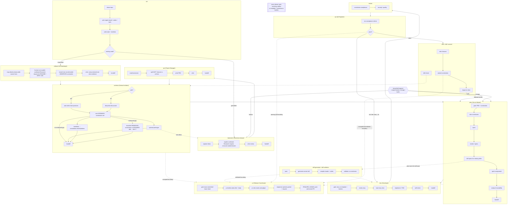

# DevForgeAI — Overview

DevForgeAI is a spec-driven development framework for AI coding agents (Claude Code and Codex CLI). It turns an idea into shipped, verified code through a fixed sequence of phases, each producing a reviewed artifact that the next phase consumes.

## Design principles

1. **Thin orchestration.** Provider entry adapters parse arguments, call the sequencer, load a skill, and print the handoff the sequencer rendered. Nothing else.
2. **The model dispatches, the sequencer decides.** Write permission is per role: producer workers write inside the run's candidate root and return a receipt that names paths, never file bodies; judge workers write nothing and return their findings as a bounded `findings` string in the receipt (at most 16 KiB), which the sequencer persists to the run's evidence directory. That findings body reaches the primary window as the subagent's result, as the provider model requires; the worker's transcript, reads, tool traffic and reasoning stay isolated. The primary window dispatches those workers and calls the model-callable sequencer operations; the deterministic `devforgeai` sequencer owns the candidate root, gates, checkpoints, runs the transition oracle, advances, promotes, and is the sole writer of canonical `.devforgeai/**`. See `01-skill-anatomy.md#primary-window-contract` and `10-sequencer-and-contracts.md`.
3. **The primary window does trivial work only.** Anatomy-governed phase skills delegate their bounded sub-phases. Research is the explicit exception: `framework/skills/research/` defines its P0-P9 workflow, contracts for four bounded worker roles that write nothing, typed records, and deterministic Research Core as the sole canonical writer. Those contracts do not make provider workers installed or executable.
4. **Provenance over recall.** A non-Research artifact claim traces to a constitution section, code file, or sealed Research dossier reference, or is tagged `ASSUMPTION`. Research uses only its closed claim types and never treats `ASSUMPTION` as a claim or evidence class.
5. **Context slicing.** Downstream phases never read entire constitution documents. They receive excerpts with anchors and hashes (see `01-skill-anatomy.md`).
6. **Gate on entry.** Every anatomy-governed skill validates its incoming artifact against that artifact's template and provenance chain before doing any work. Research instead applies the request, schema, custody, verification, and sealing gates under `framework/skills/research/`. A story whose context bundle hashes no longer match the constitution is rejected at the door, not discovered in dev.
7. **Dedicated templates.** Every anatomy-governed non-Research skill owns its templates under `.devforgeai/skills/<name>/templates/`. Templates are the contract between those phases; Research uses typed schemas and contracts.
8. **One pipeline, two entry doors.** Greenfield enters at `init → brainstorm`. Brownfield enters at `init → onboard`, then joins the same pipeline at a phase the user selects per request.
9. **Provider neutral semantics.** A neutral capability or skill specification is authoritative; Claude Code and Codex adapters are generated separately when their invocation controls or metadata differ (see `04-dual-target.md`).

The draft landscape comparison in `docs/research/sdd-landscape-comparison-2026-09-02.md` is non-normative evidence. Its recommendations change this design only when an applicable design document states the resulting contract explicitly.

## Phases

| # | Phase | Persona | Command | Primary artifact |
|---|-------|---------|---------|------------------|
| 0 | Init | Installer | `/init` | `.devforgeai/state.yaml`, doc skeleton |
| 0b | Onboard (brownfield) | Archaeologist | `/onboard` | optional non-derivable OBSERVED constraints; source-derived facts stay live |
| 1 | Brainstorm | Business Analyst | `/brainstorm <slug>` | `docs/brainstorm/<slug>.md` |
| 2 | Project Management | Project Manager | `/pm <slug>` | `docs/PM/<slug>/prd.md` |
| 3 | Architecture | Senior Architect | `/architect <slug>` | constitution, sourcetree, techstack, architecture, design-* |
| 4 | Plan | Scrum Master | `/plan <slug>` | epics, stories, sprints |
| 5 | Dev | Developer | `/dev <story>` | code, tests |
| 6 | Review | Reviewer | `/review <story>` | review report |
| 7 | QA | QA Engineer | `/qa <story>` | pass/fail, fix guidance |
| 8 | Close | Scrum Master / Architect | `/retro`, `/amend`, `/drift` | lessons, amendments, drift report |

Cross-cutting persistent Research accepts only `/research <slug> --request <request-file> --confirm-request <sha256>` on Claude and `$research <slug> --request <request-file> --confirm-request <sha256>` on Codex. Pull-request preparation accepts only explicit full commit pins through `/pr --base <40hex> --head <40hex> [--draft]`; it prepares a checked external packet and never calls GitHub. Other entries use their target-specific adapter form for `clarify`, `analyze`, `skill-gen`, `skill-validate`, and `status`.

## Phase diagram



## Repository layout produced by the framework

Everything under canonical `.devforgeai/` is written by the `devforgeai` sequencer and by nothing else. A producer worker writes only inside its run's candidate root, and those bytes reach the canonical tree by promotion.

```
.devforgeai/
  state.yaml              # story statuses, runs, next command
  stack.yaml              # hash-pinned build/test/lint/format contract; see 10
  hooks/                  # dispatch.py, policy.py, devforgeai.py; installed by init
  work/<run>/             # evidence home: <phase>-report.md, <phase>-result.json, handoff.json
  work/<run>/run.yaml     # per-run enforcement: phase, fence, granted keys, lease (gitignored)
  work/pr-*/output/       # accepted external title/body, pr-request.json and pr-packet.json; never promoted
  work/<run>/evidence/<agent>/  # findings.md, written by the sequencer from a judge's receipt (gitignored, never promoted)
  work/<run>/wt/          # the run's candidate root, where producers write (gitignored)
  sessions/<session_id>.json  # session evidence, written once by hook-only session-start
  provenance/
    adr/NNNN-*.md         # architecture decisions
    log.jsonl             # one line per skill run
  research-cas/sha256/... # local-only retained Research bytes; never tracked
  skills/<name>/
    skill.yaml            # neutral skill spec (compiled to .claude/ and .agents/)
    templates/*.md        # this skill's dedicated templates
docs/
  research/
    _cas/sha256/...       # tracked objects that passed Research custody gates
    <slug>/registry.jsonl
    <slug>/runs/RUN-NNNNNN/  # canonical JSON/JSONL, handoff.json, MANIFEST.sha256
  brainstorm/<slug>.md
  PM/<slug>/prd.md
  PM/<slug>/backlog-ideas.md
  architecture/
    constitution.md
    sourcetree.md
    techstack.md
    architecture.md
    design-<topic>.md
  plan/<slug>/
    epics/EPIC-NNN.md
    stories/STORY-NNN.md
    sprints/sprint-NNN.md
    skill-specs/SKILL-SPEC-NNN.md
  reports/
    analyze-*.md, review-*.md, qa-*.md, drift-*.md, retro-*.md
```

`docs/reports/*` is a rendered view of `.devforgeai/work/<run>/`, written by the sequencer at `phase next`. The evidence itself lives under `work/<run>/`; see `01-skill-anatomy.md#evidence-home`.
