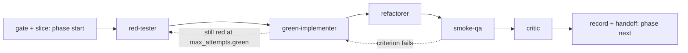

# Subagent Sets

This document is authoritative for worker names. Where `02-skill-roster.md` names workers, that column is a strict subset of the table below.

Every anatomy-governed non-Research skill owns a dedicated set of workers. Research is the explicit exception governed by `framework/skills/research/`; it defines contracts for four bounded worker roles that write nothing and deterministic Research Core as sole canonical writer. Current provider templates do not execute those workers. This document lists the sets and gives `dev-tdd` as the worked example.

Write permission is per role, there are exactly two roles, and every worker header declares its role as `writes: candidate | none`.

| Role class | Who | `writes` | Tools |
|---|---|---|---|
| Producer | red, green, refactor and fix workers; every document writer (story, prd, adr, design, brainstorm, sourcetree, techstack, code_map, skill files, retro, drift, clarification, impact, validate reports) | `candidate` | `Read`, `Grep`, `Glob`, `Edit`, `Write` (Codex: `apply_patch`), and `Bash(devforgeai run *)` for the stack keys the phase granted |
| Judge | gate resolver, critic, reviewer, smoke and QA verifier, analyze, status | `none` | `Read`, `Grep`, `Glob`, `Bash(devforgeai status)`. No `Write`, no `Edit`, no `apply_patch` |

A producer writes inside the run's candidate root and nowhere else; `devforgeai run <key>` executes with cwd = `candidate.root`. A judge creates no file anywhere: it holds no write tool, and it returns its detailed evidence as the receipt's `findings`, at most 16384 UTF-8 bytes. The sequencer persists that string verbatim to `.devforgeai/work/<run>/evidence/<agent>/findings.md` at ingest — a run-scoped, gitignored path that is never promoted and that the worker neither chooses nor reaches — and the next phase's worker reads it by that path. `issues[]` stays the bounded routing summary. No worker of any class holds a git write, a package manager, a network tool, or a raw stack command.

The `findings` string is returned to the primary window as the subagent's result, so its body does enter the primary context; that is why it is capped. What stays isolated is the judge's transcript, its reads, its tool traffic and its reasoning, and a producer still returns no file body at all. The `devforgeai` sequencer owns the root, derives what changed from the checkpoint diff, runs the transition oracle, and advances; canonical `.devforgeai/**` stays the sequencer's alone.

## Contract format

Each worker file (`.devforgeai/skills/<skill>/subagents/<role>.md`) has a header:

```yaml
name: red-tester
skill: dev-tdd
writes: candidate              # candidate (producer) | none (judge)
responsibility: Write failing unit tests that encode the story's acceptance criteria. Nothing else.
inputs:
  - story.md (context bundle + acceptance criteria only)
  - existing test conventions slice (techstack.md#testing)
outputs:                       # written under candidate.root; claimed in the receipt
  - tests/<story-id>/*.test.*    # one test per acceptance criterion, at the path the story's test_plan names
must_not:
  - write or modify production code
  - weaken a criterion to make a test easier
  - read files outside the context bundle
  - write outside the candidate root, or outside the phase's test paths
  - run a raw stack command, a git write, a package manager, or a network tool
tools: [Read, Grep, Glob, Edit, Write, Bash(devforgeai run *)]   # producer set; a judge declares [Read, Grep, Glob, Bash(devforgeai status)]
isolation: required
returns: devforgeai.worker-result/v1
```

`must_not` is compiled into the agent prompt verbatim. `tools` is compiled into the target's tool allowlist where the target supports it, and matches the role `writes` declares: a `writes: candidate` worker carries Edit, Write and `devforgeai run` for its granted keys; a `writes: none` worker carries no write tool at all and returns `findings` instead.

The worked example below uses a Python fixture as illustration only. Command, language, package-manager, and test-layout resolution is the `stack.yaml` contract in `10-sequencer-and-contracts.md`; no worker receives a literal command. A producer that needs the tests calls `devforgeai run <key>` for a key its phase granted, and the sequencer re-runs the transition oracle itself at `ingest-result` — the worker's run is for its own feedback, never the reason a phase advances.

## Worked example: dev-tdd

Generated by skill-generator when `constitution.md#mandates` contains `tdd: required`. Replaces `dev` for that project.



Rows 1-3 are producers and write inside the candidate root; rows 4-5 are judges, write nothing anywhere, and return their evidence as the receipt's `findings`, which the sequencer persists under `work/<run>/evidence/<agent>/findings.md`. Each phase builds on the previous phase's checkpoint, so the history is linear: base → red → green → refactor.

| Order | Worker | `writes` | Sole responsibility | Reads | Writes | Must not |
|-------|--------|----------|---------------------|-------|--------|----------|
| 1 | red-tester | candidate | Turn each acceptance criterion into a failing test | story context bundle, testing conventions slice | test files under the phase's test paths, one per `test_plan` row | touch production code; skip a criterion |
| 2 | green-implementer | candidate | Make the red tests pass with the smallest change | story bundle, red result, test files, code slice named in bundle | production code | edit tests; add behaviour no test demands |
| 3 | refactorer | candidate | Improve structure with tests staying green | green result, changed files, constitution style slice | production code | change behaviour; edit tests; touch files outside the diff |
| 4 | smoke-qa | none | Check each criterion once against the oracle output the sequencer recorded | story acceptance criteria, `<phase>-result.json` test results | nothing on disk: pass/fail per criterion in the receipt's `findings`, which the sequencer persists | run any command other than `devforgeai status`; write anything at all; write code or tests |
| 5 | critic | none | Confirm every criterion maps to a test, every test to code, no `ASSUMPTION` left unresolved, diff respects the constitution slice | all four results, checkpoint diff, the persisted `smoke_qa` findings by path | nothing on disk: a verdict in the receipt's `findings`, which the sequencer persists | repair anything; write anything at all |

Loop rules:

- Attempt limits are the per-phase map in `.devforgeai/work/<run>/run.yaml`, `max_attempts: {red: 2, green: 3, refactor: 2, default: 2}`. When green reaches its limit the story returns to red-tester with a note, then to the user via handoff.
- smoke-qa failure sends the failing criterion back to green-implementer, not to red-tester. Tests are the contract; code moves to meet them.
- smoke-qa is deliberately narrow. It answers "does this story work" so dev can hand off cleanly. The full regression, cross-story checks, and evidence capture belong to the `qa` skill.
- No worker in this loop names a literal test command, and no worker is trusted to report the result. A producer may call `devforgeai run test` for its own feedback; the sequencer re-runs the oracle at `ingest-result`, against the bytes in the candidate root, and that run is what advances or rewinds the phase.

Handoff after dev-tdd: `/review STORY-NNN`.

## Sets per skill

Gate, Slice, Record and Handoff dispatch no LLM. They are sequencer operations. No skill has a Slice worker and there is no shared framework worker: the incoming artifact already carries a hashed `context[]` bundle, the gate re-resolves it, and `phase start` writes the result to `.devforgeai/work/<run>/context.json` for every worker of the run (`01-skill-anatomy.md#slice-and-why-it-has-no-worker`). A run whose gate identifies no incoming artifact records the no-op in the same file.

| Sub-phase | Performed by |
|-----------|--------------|
| Gate | `devforgeai phase start` |
| Slice | `devforgeai phase start`, which writes `.devforgeai/work/<run>/context.json` |
| Record | `devforgeai phase next` |
| Handoff | `devforgeai phase next` |

For anatomy-governed skills, the skill-owned workers listed here fill Work,
Write, and Review; the primary window dispatches them and reads only their
receipts — including, from a judge, the bounded `findings` body the receipt
carries (see `01-skill-anatomy.md`). Whether a worker is a producer or a judge
is its own header's `writes` field, and the tables below name the workers, not
their write class. The Research row names contracts only and does not authorize
current provider dispatch.

| Skill | Workers (in run order) |
|-------|------------------------|
| init | none; `SKILL.md` is a thin wrapper over its bundled `scripts/install.py` |
| onboard | code-mapper, doc-ingester, convention-inferrer, observed-writer, critic |
| brainstorm | idea-capturer, research-requester (prepares a complete request file, stops for the human's explicit digest-confirmed Research invocation, then consumes the sealed dossier), idea-clusterer, brainstorm-writer, critic |
| research | contracts for discovery, evidence-extractor, contrary-evidence, verifier, none of which write a canonical artifact; current Core does not launch them; deterministic Research Core is the sole canonical writer |
| pm | scope-splitter, prd-writer, backlog-archiver, critic |
| architect | option-comparer (yolo) or decision-interviewer, constitution-writer (including `#mandates`), sourcetree-writer, techstack-writer (emits the INTENDED `stack.yaml`), architecture-writer, design-writer, adr-writer, gap-analyzer (brownfield), prototyper (optional), critic |
| plan | epic-writer, story-writer, skill-spec-writer, dependency-mapper, estimator, sprint-writer, critic |
| clarify | ambiguity-finder, question-writer, answer-recorder |
| analyze | cross-referencer, orphan-finder, stale-hash-finder, report-writer |
| skill-generator | spec-reader, skill-yaml-writer, subagent-writer, template-writer, claude-compiler, codex-compiler |
| skill-validator | anatomy-checker, provider-checker, spec-conformance-checker, report-writer |
| dev (plain) | implementer, test-writer, smoke-qa, critic |
| dev-tdd | red-tester, green-implementer, refactorer, smoke-qa, critic |
| review | compliance-checker, security-checker, style-checker, review-writer |
| qa | test-runner (names `commands.use` keys and reads the oracle output the sequencer recorded in `<phase>-result.json`; it runs nothing itself), criteria-checker, evidence-collector, qa-writer |
| amend | change-applier, adr-writer, impact-analyzer, resync-slicer |
| retro | report-collector, lesson-extractor, amendment-proposer, archiver |
| drift | code-mapper, doc-differ, drift-writer |
| status | none; `SKILL.md` is a thin wrapper over `devforgeai status` |

Project-specific skills generated by skill-generator follow the same rule: the `SKILL-SPEC-NNN.md` that describes them must list their workers with the contract header above, and skill-validator rejects a spec whose workers lack `responsibility`, `must_not` or `writes`, or whose `tools` do not match the role `writes` declares.
