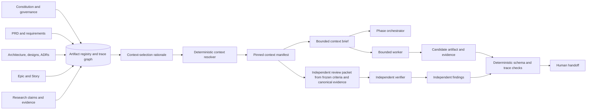

# Context, traceability, delegation, and handoffs

Evidence map: `CLM-007` through `CLM-012`, `CLM-015`, `CLM-019`,
`CLM-023` through `CLM-025`, `CLM-029`, `CLM-030`, `CLM-032`, `CLM-036`,
`CLM-041`, `CLM-044`, `CLM-046`, and `CLM-048` through `CLM-050` in
[the claim ledger](claim-ledger.md).

## Context should be compiled, not copied

Copying “relevant portions” of the constitution, tech stack, source tree, and
architecture into every Epic and Story reduces the initial read, but creates a
more dangerous problem: duplicated authority drifts.

Use two products instead:

1. a machine-readable **context manifest** that pins canonical artifact IDs,
   versions, section anchors, and digests; and
2. a generated **context brief** that contains only the selected excerpts and
   explanations needed by the current task.

The brief is disposable. The manifest is the reproducible derivation record.



## Context manifest contract

An illustrative manifest:

```yaml
context_manifest_id: CTX-STORY-014-03
subject:
  artifact_id: STORY-014
  version: 3
generated_at: 2026-09-01T00:00:00Z
budget:
  target_tokens: 12000
sources:
  - artifact_id: CONST-001
    version: 4
    subject_sha256: "..."
    anchors: ["quality.test-policy", "governance.source-precedence"]
    applicability: "Controls verification and conflict handling for this Story."
  - artifact_id: ADR-012
    version: 1
    subject_sha256: "..."
    anchors: ["decision", "consequences.api-errors"]
    applicability: "The Story changes this interface."
  - artifact_id: RESEARCH-CLAIM-083
    version: 2
    subject_sha256: "..."
    applicability: "Supports the selected external API constraint."
exclusions:
  - artifact_id: DESIGN-OLTP-004
    reason: "No persistence behavior is touched by this Story."
unresolved:
  - ambiguity_id: AMB-017
    owner: "Architecture"
stale_if:
  - "any selected source version or digest changes"
  - "the Story acceptance criteria change"
```

### Selection rules

- Start from the task's stable requirement, interface, component, risk, and
  evidence IDs. Do not select context only by semantic similarity.
- Include rationale and negative constraints when omitting them could reverse a
  decision.
- Include the source priority and amendment rule whenever sources may conflict.
- Record exclusions so a future reviewer can distinguish deliberate omission
  from retrieval failure.
- Fit a declared budget. If the task cannot fit, split the task rather than
  silently truncating critical instructions.
- Resolve and read the pinned source when exact wording matters; do not rely on
  the generated brief as the only authority.
- Mark the manifest `STALE` whenever a pinned source changes. Never silently
  regenerate it during Development because the human may need to approve the
  changed scope.

## Bidirectional traceability

The minimum useful graph is:

```text
stakeholder need
  <-> product requirement
  <-> architecture decision or design element
  <-> Epic
  <-> Story requirement and acceptance criterion
  <-> implementation change
  <-> test/oracle and result
  <-> review and QA decision
  <-> released artifact and operational signal
```

Every edge needs a type, source, target, version, creator, and evidence. The
validator should detect:

- a requirement with no downstream realization or verification;
- code or a task with no upstream justification;
- an acceptance criterion with no oracle;
- a test that does not map to an accepted criterion;
- a Story that references a superseded ADR or stale context manifest;
- a released artifact that does not bind the reviewed source revision;
- a changed source with downstream artifacts that have not been impact-assessed.

Traceability is not achieved by repeating prose. It is achieved by stable,
versioned relations that can be queried in both directions.

## Research cache and provenance chain

The reusable chain should be:

```text
research question
  -> query record
  -> opened primary source
  -> bounded evidence note
  -> atomic claim
  -> synthesis or decision
  -> downstream artifact references
```

Suggested cache shape:

```text
docs/research/<slug>/
├── README.md
├── questions.md
├── claims.jsonl
├── query-log.jsonl
├── decisions.md
├── sources/
│   └── <source-id>-<slug>.md
└── MANIFEST.sha256
```

Each source record should capture:

```text
source_id, title, publisher, canonical_url
published_or_updated_at, retrieved_at
source_type, primary_or_secondary
retrieval_method, retrieval_status
relevant_sections, bounded_paraphrase_or_excerpt
content_or_snapshot_digest_when_available
supported_claim_ids[], contradicted_claim_ids[]
limitations, freshness_policy
```

Each claim should be atomic and keep separate fields for:

- `source_fact`: what the source directly establishes;
- `inference`: what the framework designer concludes from it;
- `decision`: what the authorized human chooses;
- `confidence` and `unknowns`;
- supporting and contrary source IDs.

Do not let a search-result snippet become a claim source. Open or fetch the
underlying page. Prefer primary sources, and retain contrary evidence rather
than optimizing the cache for a predetermined answer.

## Delegation gate

Subagents should be used only after the orchestrator answers these questions:

| Question | Delegate when | Keep centralized when |
|---|---|---|
| Decomposability | Workstreams have clean, independently checkable boundaries | Each step changes the assumptions needed by the next |
| Mutable state | Workers are read-only or own disjoint files/worktrees | Workers contend for the same state or artifact |
| Reconciliation | Outputs share a closed schema; central reconciliation can validate schema and direct evidence, with an independent verifier for high-risk or disputed claims | Correct synthesis depends on tacit intermediate reasoning |
| Evidence | Each worker can return primary references, diffs, or test evidence | Only a narrative opinion can be returned |
| Cost | Expected quality/latency benefit justifies extra tokens and coordination | Task is small, sequential, or already fits the main context |
| Authority | Worker permissions can be narrowed to its exact job | Worker would inherit unnecessary or irreversible authority |

Parallel research, repository exploration, log triage, and independent review
are good candidates. A tightly sequential design decision or multiple agents
editing one Story implementation usually is not.

### Required delegation envelope

Every worker request should declare:

```text
objective and why this worker exists
exact in-scope and out-of-scope work
input artifact IDs, versions, paths, and digests
relevant context manifest and unresolved ambiguities
trace ID plus provider, model, agent, skill, and harness versions
allowed tools, network, secret access, trust class, and write fence
expected output schema and storage path
evidence/citation requirements
success, stop, and escalation conditions
maximum workers, concurrency, tool calls, retries, tokens, and deadline
partial-result policy and explicit dependency/barrier semantics
conflict-reconciliation policy
```

Repository, web, research, issue, and MCP content is untrusted data. It cannot
be promoted into privileged worker instructions merely because it appears in an
input artifact.

Worker summaries are leads, not proof. The parent should read the cited source,
diff, or test evidence needed for the final decision. Required results must
arrive before any dependent canonical synthesis. For high-risk acceptance,
provide a fresh verifier the frozen criteria and primary evidence without the
author's verdict or rationale. For disputed-claim verification, additionally
provide the atomic claim under test, but not the author's reasoning, confidence,
or proposed disposition.

### Result reconciliation

Use a centralized reconciler to:

1. consume deterministic schema and authority-check results;
2. reject invalid results or those missing evidence or exceeding authority;
3. group agreements and contradictions by stable claim/finding ID;
4. send disputed claims to an independent verifier or human;
5. preserve original worker artifacts instead of repeatedly summarizing them;
6. account explicitly for unreturned lanes and incomplete coverage; and
7. write only the authorized synthesis into the canonical artifact.

Worker agreement or majority vote is not correctness: correlated agents can
repeat the same error. A claim becomes verified only through an applicable
independent oracle or verifier, not reconciliation alone.

## Handoff is a protocol

Every phase owns the accuracy of the handoff facts it emits. A deterministic
shared renderer can format them and a validator can enforce shape and artifact
binding, but neither should invent phase status, semantic acceptance, or project
decisions.

### Required handoff fields

| Section | Required content |
|---|---|
| Location | Project/slug, workflow, phase, subphase, and `YOU ARE HERE` marker |
| Result | Closed outcome token and plain-language explanation |
| Canonical artifacts | ID, version, path, lifecycle/readiness status, applicable verification status, SHA-256, and owner |
| Source basis | Input artifact IDs/revisions and context-manifest ID |
| Validation | Commands/checks, result, environment, evidence IDs, and anything not run |
| Decisions | Accepted decisions and named authority |
| Open items | Ambiguities, risks, questions, blocked items, and their owners |
| Next action | Exact provider-specific invocation and required arguments |
| Session guidance | Continue versus start a fresh/cold session, with reason |
| Authority/fence | What the next workflow may read/write and what requires approval |
| Repair route | Exact source owner to revisit if the next gate fails |

### Example professional rendering

| Field | Value |
|---|---|
| Location | Project `project-slug`; workflow `Architecture`; phase `Decision`; subphase `ADR selection`; **YOU ARE HERE** |
| Workflow map | Brainstorm ✓ → Product ✓ → Architecture **YOU ARE HERE** → Backlog ○ → Story ○ |
| Outcome | `NEEDS_DECISION` — two viable data-storage choices remain |
| Canonical artifacts | `PRD-001@3`, `docs/product/demo/prd/PRD-001.md`, lifecycle `ACCEPTED`, readiness `READY`, SHA-256 `{digest}`, owner `person:user-042` |
| Source basis | `BRAINSTORM-001@2`; `PRD-001@3`; `CTX-ARCH-001@4` |
| Validation | Architecture schema `PASS`, evidence `EVD-091`, environment `provider/model/runtime@versions`; source-tree validation `COULD_NOT_RUN` because prerequisite `ADR-004` is unresolved |
| Accepted decisions | MVP scope accepted by `person:user-042 (Dana Lee)`; no storage decision accepted |
| Open items | `ADR-004@1` is `PROPOSED`; select option A or B; owner `person:user-017 (Arun Shah)`; due/expiry `{timestamp}` |
| Next Claude action | `/architecture project-slug --resume ADR-004` |
| Next Codex action | `$architecture project-slug --resume ADR-004` |
| Session | Start a fresh session after the decision so the accepted artifact, not debate history, is the working context |
| Authority/fence | May read accepted Product/Research artifacts and write only the Architecture package; ADR acceptance requires `person:user-042` and `person:user-017` |
| Repair route | Product: Claude `/product-requirements project-slug --amend PRD-001`, Codex `$product-requirements project-slug --amend PRD-001`; evidence: Claude `/research project-slug --question RQ-014`, Codex `$research project-slug --question RQ-014` |
| Stop rule | Do not create Epics until `ADR-004` is `ACCEPTED` and the context manifest is regenerated |

### Human-in-the-middle semantics

A human gate must identify the decision authority, alternatives, evidence,
reason, scope, and expiry. A generic “approve?” prompt is not governance.
Irreversible, destructive, privileged, costly, or materially externally
consequential actions—including external writes, messages, deployments,
purchases, permission changes, or scope expansion—plus changes to accepted
product meaning, constitution amendments, security exceptions, release/deploy
decisions, and acceptance-oracle weakening should be explicit human decisions.
Oracle weakening creates a new version, records approver and rationale,
invalidates prior passes, and requires an independent rerun.
