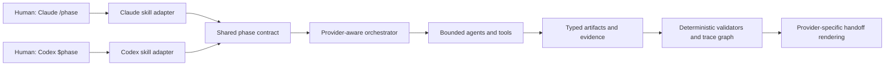

# Claude and Codex provider adapters

Provider parity should mean the same accepted inputs, outputs, state transitions,
and evidence obligations. It should not require identical files, invocation
syntax, hook events, or provider-native failure signaling. Adapters must normalize
supported native outcomes into the same framework failure policy and state
transition.

Evidence map: `CLM-001` through `CLM-007`, `CLM-020`, `CLM-022`, and
`CLM-027` through `CLM-035`, `CLM-040`, `CLM-043`, `CLM-046`, `CLM-051`,
`CLM-052`, and `CLM-055` in [the claim ledger](claim-ledger.md). Framework
decisions in the rightmost column remain proposals until accepted.

## Current surface comparison

| Concern | Claude Code | Codex / ChatGPT | Framework decision |
|---|---|---|---|
| Explicit skill invocation | `/skill-name` | Codex CLI/IDE: `$skill-name` or `/skills`; ChatGPT surfaces: `@skill-name` | Document each supported form; keep one provider-neutral skill ID |
| New custom slash workflow | A skill itself exposes `/name`; custom commands were merged into skills | Custom prompt-based slash commands are deprecated; use skills | Do not build a new Codex command layer on deprecated prompts |
| Project skill location | `.claude/skills/<name>/SKILL.md` | `.agents/skills/<name>/SKILL.md` at the CWD and each ancestor through the repository root | Generate/install provider adapters from one neutral contract |
| Always-on project guidance | `CLAUDE.md` and scoped `.claude/rules/` | `AGENTS.md` and nested overrides | Keep these concise; link to canonical project artifacts |
| Project subagent profile | `.claude/agents/` | `.codex/agents/*.toml` | Generate different adapters; test least-authority behavior |
| Context-isolated skill | Claude extension `context: fork` and `agent` | Orchestrator explicitly delegates to a subagent | Treat isolation as an execution policy, not portable frontmatter |
| Hook handlers | Command, HTTP, `mcp_tool`, prompt, and experimental agent handlers | Command and `mcp_tool` handlers; prompt/agent handlers are not executed | Only deterministic command-hook semantics belong in the common baseline |
| External capabilities | MCP | MCP/apps | Skill defines method; server/tool owns live data and controlled actions |
| Distribution | Claude plugin can bundle skills, agents, hooks, MCP, and compatibility commands | OpenAI plugin can package skills, MCP, and Codex lifecycle hooks | The framework should digest packages and test installed behavior; sign only after an identity/key/verifier design is accepted; neither provider is presumed to supply that custody guarantee |

Official sources: [Claude skills](https://code.claude.com/docs/en/skills),
[Claude extensibility overview](https://code.claude.com/docs/en/features-overview),
[Claude subagents](https://code.claude.com/docs/en/subagents),
[Claude hooks](https://code.claude.com/docs/en/hooks),
[Codex skills](https://learn.chatgpt.com/docs/build-skills),
[Codex subagents](https://learn.chatgpt.com/docs/agent-configuration/subagents),
[Codex hooks](https://learn.chatgpt.com/docs/hooks), and
[Codex custom prompts](https://learn.chatgpt.com/docs/custom-prompts).

## The thin-entrypoint pattern



The entrypoint should do only this:

1. parse and normalize arguments;
2. identify the project/slug and requested operation;
3. call the deterministic preflight for state, authority, artifact freshness,
   and required inputs;
4. load the shared phase contract and provider adapter;
5. run the phase and render the validated handoff.

It should not duplicate interview logic, templates, gates, or artifact semantics.

## Portable skill core and generated wrappers

Both products support the open [Agent Skills specification](https://agentskills.io/specification),
whose portable core is a skill directory with `SKILL.md`, required `name` and
`description`, and optional `scripts/`, `references/`, and `assets/`. Local
Claude Code can derive `name` and treats `description` as recommended, but a
cross-provider package should satisfy the stricter portable floor.
Progressive disclosure loads metadata first, the body on activation, and
supporting resources only when needed.

Claude and Codex add different extensions. Therefore use a source model like:

```text
capabilities/<skill-id>/
├── capability-spec.yaml
├── workflow.md
├── contracts/
├── references/
├── templates/
├── scripts/
└── providers/
    ├── claude/
    │   └── SKILL.md
    └── codex/
        ├── SKILL.md
        └── agents/openai.yaml
```

The exact installed layout may differ, but the authority direction should not:
the provider-neutral capability spec and artifact schemas define semantics;
provider wrappers define discovery, invocation, tools, and execution strategy.

Do not claim byte-for-byte portability if a skill uses Claude-only fields such
as invocation controls, `context: fork`, `agent`, skill-local hooks, or dynamic
shell injection, or Codex-specific `agents/openai.yaml` policy/dependencies.
Claude dynamic `!command` injection is also surface-specific: it must not be
assumed to execute equivalently in synced, cloud, or API-hosted skills.

## Skill and context budgets

- Keep descriptions precise and non-overlapping. Eligible model-invocable skills
  advertise metadata at startup, subject to provider controls and catalog
  budgets. Claude manual-only skills can remain absent until invocation, while
  Codex may shorten descriptions or omit entries when its initial list is full.
- Keep the entry `SKILL.md` short and route to focused, one-level-deep
  references. The Agent Skills spec and Claude docs recommend a body under 500
  lines.
- Do not put the full constitution or architecture corpus in always-on
  `CLAUDE.md`/`AGENTS.md`, imported files, or every skill. Put stable routing and
  essential commands there; use the context compiler for task-specific truth.
- Treat compaction as lossy. Durable artifact IDs, manifests, and handoffs must
  be sufficient to resume after compaction or in a new session.

OpenAI documents a bounded initial skill list and recommends focused jobs;
Anthropic separately warns about long skill and agent descriptions. A curated
public roster plus internal on-demand specialists is safer than advertising
every possible role at startup.

## Subagent adapter rules

Claude subagents have separate model context, and Codex delegates into separate
agent threads; neither mechanism inherently isolates shared filesystem state.
Workers also do not automatically inherit every fact the parent has seen. The
phase should therefore send a self-contained delegation envelope.

Provider adapters should enforce these defaults:

- researcher, explorer, reviewer, and QA agents are read-only unless a narrow
  evidence path requires writes;
- only one worker owns a mutable file set at a time;
- independent workstreams may run in parallel; sequential reasoning stays with
  the orchestrator;
- every worker returns a typed result with evidence, not an unstructured essay;
- the parent performs centralized reconciliation and reads decisive evidence;
- model/cost selection is explicit and evaluated on representative tasks;
- agent teams or dynamic workflows are optional optimizations, never a
  prerequisite for a human approval gate.

For Claude, `context: fork`, preloaded skills, restricted tools/MCP, and custom
agents are useful adapter features. A forked skill runs in the background by
default; background forks have a narrower tool set and their edits are outside
session checkpoints, so a provider adapter must not equate forked context with
transactional isolation. Codex custom-agent TOML files define `name`,
`description`, and `developer_instructions`, and may set supported session keys
such as `model`, `model_reasoning_effort`, `sandbox_mode`, `mcp_servers`, and
`skills.config`. Omitted settings inherit from the parent, and live parent
sandbox/approval overrides are reapplied at spawn. None of these provider
controls replaces the framework's own authority and evidence checks.

## Hook architecture

### Use hooks for events; use the CLI/service for authority

Good hook uses:

- verify session/workspace identity and hook health;
- block a prohibited path or destructive command before execution;
- call the phase/state validator before a protected mutation;
- run bounded lint/schema checks after writes;
- capture command and evidence metadata;
- check that a valid handoff exists before a phase stops.

Bad hook uses:

- encode the entire phase workflow across several unordered handlers;
- ask an LLM hook to be the sole acceptance oracle;
- assume a post-tool hook can undo side effects;
- assume every hosted/browser/tool path is observable;
- treat timeout, malformed output, or a missing script as a safe denial without
  provider-specific proof.

### Provider-specific cautions

Claude Code runs all matching hooks and supports rich handlers, but official
documentation recommends command hooks for deterministic production checks.
Exit code `2` is the blocking signal available through the command exit code
alone on block-capable events; supported schema-valid decision JSON can also
decide an event on a normal exit. Ordinary errors, invalid output, timeouts, or a
mistyped path can be nonblocking. Prompt and agent hooks are model judgments, and
agent hooks are experimental.

Codex also runs multiple matching command hooks concurrently. By default,
non-managed hooks require review and trust bound to the current definition hash;
project-local hooks also require a trusted project `.codex` layer. The documented
`--dangerously-bypass-hook-trust` flag bypasses persisted hook trust for one
invocation. `PreToolUse` can
block supported local calls, but documented tool coverage has exceptions,
including hosted tools. `PostToolUse` cannot undo a completed action. Current
Codex documentation says command and `mcp_tool` handlers run; prompt and agent
handler types are parsed but skipped. For `mcp_tool` handlers, errors, missing
servers, and unavailable tools do not block the operation. Command hooks block
only through the event-supported protocol, such as a `PreToolUse` deny result or
exit code `2`; unsupported output fields can mark a hook failed while allowing
the call to continue.

Consequently:

1. Put ordered checks in one deterministic dispatcher.
2. Make enforcement scripts return the exact blocking protocol for the current
   event and provider.
3. Run startup and CI conformance tests that prove both the allow and deny paths.
4. Keep the same critical gate in the framework CLI/CI when hook coverage is
   incomplete.
5. Pin supported provider versions and capability-probe them during install and
   upgrade.

## Guidance files versus canonical truth

`CLAUDE.md`, `.claude/rules`, and `AGENTS.md` are model instructions. They are
not canonical requirements, provenance, or enforcement. Use them for:

- repository orientation and important paths;
- exact build/test/validator commands;
- the artifact precedence rule;
- how to invoke phase skills;
- concise, universally applicable constraints.

Use canonical versioned artifacts for the constitution, PRD, architecture,
Stories, decisions, and handoffs. Use deterministic policy and hooks for rules
that must hold mechanically.

## MCP and untrusted content

MCP provides live tools and data; a skill teaches the workflow around them.
Scope each server to the workers that need it. Treat external tool results,
issue text, web pages, and documentation as untrusted evidence—not privileged
instructions. Preserve origin and retrieval metadata, constrain tool inputs and
outputs with schemas, and require human approval for consequential writes.

## Naming and collision registry

Maintain a registry across:

- Claude skills/commands, bundled skills, workflows, plugin namespaces, MCP
  prompts, and built-ins;
- Codex skills, built-in slash commands, plugins, custom-agent names, and MCP
  tools;
- deprecated compatibility artifacts that may still load.

Reject duplicate provider-neutral IDs, reserved built-in names, shadowed skills,
and ambiguous aliases. Prefer stable kebab-case IDs and provider-qualified plugin
names where supported.

## Provider conformance matrix

Every released capability should record a result for each supported provider
and version:

| Lane | What to prove |
|---|---|
| Discovery | Correct skill appears; unrelated skills do not collide |
| Invocation | Explicit arguments reach the expected phase contract |
| Implicit routing | Should-trigger and should-not-trigger prompts behave as designed, if enabled |
| Context | Required references load; excluded corpus does not; compaction/resume remains safe |
| Delegation | Worker gets the exact task packet, least tools, and expected isolation |
| Mutation fence | Allowed write succeeds and hostile/out-of-scope write is denied |
| Hooks | Both allow and block paths, handler failure, timeout, and unsupported tool paths are observed |
| Artifact output | Schema, IDs, digests, provenance, and trace edges match the neutral contract |
| Handoff | Exact next invocation and status render correctly for the provider |
| Installation/update | Source, version, digest, namespace, trust prompt, and rollback are verified |
| Fresh eval | Representative outputs pass in clean sessions; authoring context is absent |
