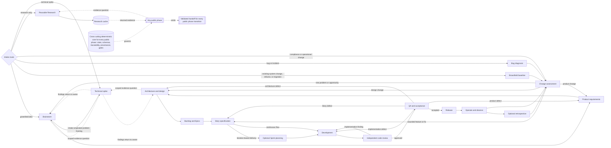
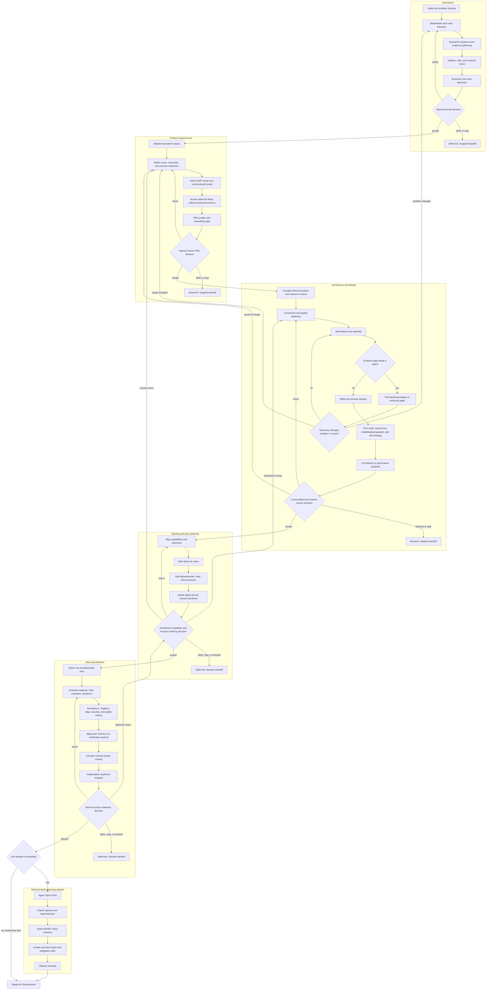
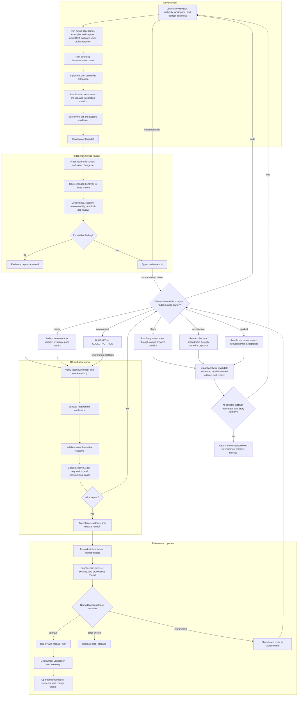

# Workflow and artifact ownership

Evidence map: `CLM-013` through `CLM-018`, `CLM-024`, `CLM-025`, `CLM-037`
through `CLM-039`, `CLM-041`, `CLM-043`, `CLM-044`, and `CLM-046` through
`CLM-050` in
[the claim ledger](claim-ledger.md). The diagrams below are framework proposals,
not claims that every cited method uses this exact lifecycle.

## End-to-end lifecycle



This is a graph, not a one-way waterfall. A downstream discovery returns to the
phase that owns the defective source. The workflow must preserve the rejected or
superseded record and then rebuild affected derived artifacts.
`Any public phase` is a global annotation: it includes every lifecycle node,
including Research, brownfield/bug routes, Sprint, Release, and Retrospective.
Research is read-only by default; a technical spike is a distinct, explicitly
fenced workflow used from Brainstorm or Architecture.

## Planning subphases



### Prototype loop

A prototype is evidence, not a stealth first implementation. Its record should
state the question, hypothesis, time box, permitted file fence, evaluation
method, result, and disposition (`discard`, `retain-as-fixture`, or separately
authorize production hardening). If it changes the understood problem, route
back to Brainstorm or Product rather than laundering the discovery into an ADR.

An optional “YOLO” user experience should be named and implemented as
`autonomous-defaults`, not as a gate bypass. The agent may choose documented,
reversible defaults; it must surface material, irreversible, security, cost, or
external-impact decisions to the human and record every assumption.

## Delivery subphases and repair routing



## Artifact ownership matrix

| Artifact | Created by | Accepted by | Consumed by | Mutation rule |
|---|---|---|---|---|
| Idea/brainstorm dossier | Brainstorm | Human sponsor | Product, Research | Version; preserve deferred/rejected options |
| Research claim ledger and source cache | Research | Phase owner accepts applicability | Any phase | Append evidence; supersede stale claims; retain source history |
| PRD and deferred-idea archive | Product Requirements | Human Product Owner | Architecture, Backlog | Amend through Product; downstream phases cannot change scope silently |
| Constitution/governance record | Governance Decision with Product/Architecture proposals | Named human authority | Every phase and deterministic policy | Accepted versions are immutable; amend/supersede explicitly |
| Tech stack and source-tree contracts | Architecture | Human/architecture authority | Backlog, Story, Development, Review | Version and impact-analyze every accepted change |
| Domain designs | Architecture specialist | Architecture authority and affected stakeholder | Backlog through QA | Split by concern; do not force irrelevant domains into every context |
| ADR | ADR Lifecycle | Named decision group/human | Story, Development, Review | Accepted ADR remains; a new ADR supersedes it |
| Epic | Backlog Planning | Product Owner with feasibility review | Story Specification, roadmapping | Re-slice/reorder without rewriting source PRD/architecture |
| Story/Specification | Story Specification | Human Product/Delivery authority | Sprint, Development, Review, QA | Stable behavioral contract; amend with impact analysis |
| Sprint ledger | Sprint Planning | Human delivery team | Development coordination | Freely replan within governance; references Story ID and revision |
| Public acceptance examples | Story Specification with QA input | Product/QA authority | Development, Review, QA | Version with the Story; Development cannot change frozen accepted examples |
| Protected held-out eval pack | Independent Oracle Custodian through access-controlled registry | QA/Product authority | QA or independent evaluator only | Never disclosed to Development; authorized change creates a new version and invalidates prior verdicts |
| Implementation/evidence record | Development | Review and QA assess it | Review, QA, Release | Append attempts/results; bind exact code and Story revision |
| Review report | Independent Review | Reviewer | Development, QA, human | Immutable report; remediation creates a linked round |
| QA report | QA Acceptance | QA/Product authority | Repair router, Release | Immutable evidence; correction creates superseding report |
| Release attestation | Deterministic build/provenance tooling; interpreted by Release | Human release authority | Consumers, Operations | Bind source, build, artifacts, builder, authenticated producer, trust policy, and approvals by digest |
| Operational feedback/incident | Operate | Service owner | Change Assessment | Preserve timeline and evidence; route without rewriting history |
| Handoff | Emitting phase supplies facts; deterministic renderer materializes them | Emitting phase owns semantic accuracy; validator checks form/binding; named human owns any decision | Next phase/session | Derived transition record; never replaces source artifacts |

## Artifact metadata and state

Every canonical artifact should have, directly or through its registry entry:

```text
artifact_id, artifact_type, schema_version
artifact_version, lifecycle_status, readiness_status
enforcement_mode
owner, decision_authority
canonical_path, subject_sha256
source_artifact_ids_and_versions[]
requirement_ids[], decision_ids[], evidence_ids[]
created_at, updated_at
supersedes[], stale_if[]
```

Keep separate state dimensions rather than overloading one `status` field:

| Dimension | Suggested closed values |
|---|---|
| Lifecycle | `DRAFT`, `PROPOSED`, `ACCEPTED`, `REJECTED`, `SUPERSEDED`, `ARCHIVED` |
| Readiness | `NOT_READY`, `READY`, `STALE` |
| Gate enforcement | `BLOCK`, `REQUIRE_HUMAN`, `WARN`, `OFF` |
| Capability | `NOT_PROBED`, `SUPPORTED`, `UNSUPPORTED_CAPABILITY` |
| Verification | `NOT_RUN`, `PASS`, `FAIL`, `COULD_NOT_RUN`, `INFRA_FAILURE`, `NOT_APPLICABLE` |
| Phase outcome | `COMPLETE`, `NEEDS_DECISION`, `BLOCKED`, `FAILED`, `COULD_NOT_RUN` |

Do not hash a document inside itself. Put the digest in the artifact registry,
handoff, or an adjacent manifest calculated over finalized bytes.

Use `COULD_NOT_RUN` when a required prerequisite or capability was unavailable
before an applicable check could execute. Use `INFRA_FAILURE` when execution was
attempted but a harness, runner, resource, timeout, or infrastructure fault made
the behavioral verdict invalid. `UNSUPPORTED_CAPABILITY` is a capability-probe
fact; an applicable check that depends on it receives `COULD_NOT_RUN`. Reserve
`NOT_RUN` for an applicable check intentionally not attempted under the declared
schedule or policy, not for an unavailable prerequisite.

Use phase outcome `COULD_NOT_RUN` only when the phase itself could not validly
start or execute because a required host capability, tool, or environment was
unavailable. Use phase outcome `BLOCKED` when the phase could execute but cannot
complete without an unresolved external decision, authority, dependency, conflict,
or required input. A check-level `COULD_NOT_RUN` does not force a phase-level
`COULD_NOT_RUN` when other meaningful phase work and a truthful blocked handoff are
possible.

## Precedence and source repair

Later artifacts may refine but must not silently override accepted upstream
authority:

```text
human governance and explicit rulings
    > accepted product requirements
    > accepted architecture decisions and interfaces
    > accepted Epic
    > accepted Story and acceptance pack
    > Sprint schedule and task plan
    > implementation narrative
```

When two accepted sources conflict, stop and request a ruling. Do not let the
nearest skill choose whichever instruction is convenient. After the source is
amended, run impact analysis, mark derived context packs stale, and regenerate
only the affected artifacts.
