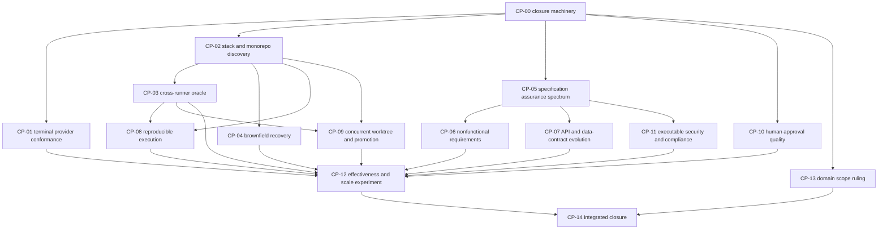

# Spec-driven development research-gap closure plan

| Field | Value |
|---|---|
| Plan ID | `SDD-GAP-CLOSURE-2026-09-03` |
| Created | 2026-09-03 |
| Re-frozen | 2026-09-04 |
| Status | `REFROZEN_PENDING_INDEPENDENT_REVIEW` |
| Base commit | `90de68ec4659189dabbab7686d06360ddd114d4d` (PR 16 merge) |
| Target environments | Claude Code terminal and Codex terminal |
| Decision authority | `github:bankielewicz` |

`MUST`, `MUST NOT`, `REQUIRED`, `SHALL`, and `SHALL NOT` are literal. A
checkpoint remains open unless every stated closure condition is satisfied.

## 1. Purpose and result

The existing research establishes a credible lifecycle, artifact model,
provider-adapter boundary, context/delegation model, evidence chain, and gate
architecture. It does not yet establish that a single DevForgeAI development
contract can discover, specify, execute, verify, and safely promote work across
multiple programming stacks and growing repositories in both Claude Code and
Codex terminals.

This plan closes that evidence gap. It separates three closure stages that MUST NOT be
collapsed:

1. `RESEARCHED`: an independently verified dossier resolves the stated
   questions and records contrary evidence and limitations.
2. `IMPLEMENTED`: accepted findings are represented in normative contracts,
   schemas, deterministic services, fixtures, and tests.
3. `PROVEN`: the implementation passes its deterministic suite and the required
   live Claude Code and Codex terminal probes.

A research checkpoint may close at `RESEARCHED` only when its declared type is
`RESEARCH_ONLY`. A checkpoint declared `RESEARCH_AND_IMPLEMENTATION` MUST reach
all three stages. These stages do not replace the phase outcomes in
`framework/contracts/error-taxonomy.yaml`. A document, schema, model assertion,
successful unit test, or hook event alone is not provider proof.

This plan is executable immediately through ordinary terminal operations. It
does not assume that `/research`, `$research`, a DevForgeAI installer, a hosted
workflow, an IDE integration, or an experimental agent-team feature works. The
current normative Research workflow explicitly reports that provider worker
execution is unavailable. Those entrypoints may replace manual steps only after
checkpoint `CP-01` closes.

## 2. Frozen input evidence

The assessment is re-frozen against these exact inputs at base commit
`90de68ec4659189dabbab7686d06360ddd114d4d`:

| Input | SHA-256 | Use |
|---|---|---|
| `docs/research/spec-driven-ai-framework-skill-roster/MANIFEST.sha256` | `164ff0b051b6e9a07885b1bc5d90ed02d9cc17ee15bc5f69d9a09973b677fcd5` | Independent lifecycle, skill, provider, assurance, and repository-corpus research |
| `docs/research/sdd-landscape-comparison-2026-09-02.md` | `280ca60a6b398b76c713de6865b92e13dbb25a07bf6ab4541426e3228854c0be` | Verified landscape comparison and identified tensions |
| `docs/research/codex-hook-runtime-live/20260903T142001Z-cli-0.152.1/checksums.sha256` | `26f921c101314a7e3d4e9b1b347e7456e337c95ac6573af9184f1f8da94005d6` | Codex hook-boundary live evidence |
| `framework/skills/research/workflow.md` | `6d69fd2983622f7759cb990505cb2ef1c98ecde682c6fc09c28bf216df3b937b` | Current P0-P9 Research contract and its declared unavailable paths |
| `framework/contracts/error-taxonomy.yaml` | `7560b879e66afb3a35d113c73e92abe3d2e96b0269526e9c37cc9f4f2220eb57` | Closed failure and phase-outcome vocabulary |
| `docs/CHECKPOINT.md` | `a4a6cb739f84a4c82076c32c4dc348613b617a694108ea117831251cc7301831` | Check-ins 13 through 18, including the governing amendments and provider evidence ledger |

The first four input digests remain equal to the original assessment. The error
taxonomy and checkpoint ledger changed and were recomputed from the re-frozen
base. The skill-roster manifest was rechecked with `sha256sum -c`; all 13
entries passed. The Codex live-hook bundle proves the exercised interception
boundary only. Its own report excludes complete containment and leaves worktree
isolation, sequencer diffs, transition oracles, promotion, and CI as separate
controls.

### 2.1 Re-freeze evidence and admission state

Check-ins 13 through 18 are cited from the exact `docs/CHECKPOINT.md` bytes in
the frozen-input table. They have these uses; they are evidence records, not
substitutes for the raw artifacts they name:

| Check-in | Use in this re-freeze |
|---|---|
| 13 | the ten amendments that govern this revision and the CP-00-first admission rule |
| 14, both entries | D13-D15 implementation state, the first live judge-persistence proof, and the two Claude Code 2.1.259 observations |
| 15 | the historical 6/7 build and D16 correction set; that build is not admitted |
| 16 | generated build 3 at 7/7, 4/4, 5/5 and live run 4 |
| 17 | D17 implementation, build 4 at 7/7, 4/4, 5/5, and the provider-allowlist correction |
| 18 | live run 5 and both D17 runtime probes |

The re-freeze was checked from this worktree against the frozen base with these
foreground commands. These results validate the current repository and this
plan's source inputs; they do not start or close a checkpoint and are not live
provider proof:

| Command | Observed result |
|---|---|
| `PYTHONPATH=components/research-core/src python3 -m pytest tests/research -q` | exit 0; 165 tests passed, 92 subtests passed, 3 deprecation warnings |
| `python3 docs/design/specs/verify.py` | exit 0; V1, V2, V3, V4, V8, and V9 passed; 18 specs checked |
| `python3 docs/design/examples/hooks/run_conformance.py` | exit 0; 240/240 rows held: 147 dispatcher, 35 grammar, and 58 backstops |
| `bash docs/design/examples/hooks/demo_sequencer.sh` | exit 0; Python and Node passed in copy and worktree modes |
| `python3 components/hook-runtime/reference/claude-python/tests/run_tests.py` | exit 0; 23/23 tests passed |

The field name `admitted_inputs` is reserved below because CP-00 will make it a
validated checkpoint-record field. At this re-freeze every listed entry has
state `AVAILABLE_FOR_ADMISSION`, not `ADMITTED`: CP-00 is not closed, no later
checkpoint has started, and no closure stage is `PASS`. After CP-00 closes, a
work PR may copy or reference immutable evidence, validate every digest, and
change an entry to `ADMITTED`. Merely appearing in this plan does not perform
that transition.

The strongest single Claude input for CP-01 is run 5:

| Field | Frozen value |
|---|---|
| Input ID | `CP01-CLAUDE-RUN5` |
| State | `AVAILABLE_FOR_ADMISSION` |
| Provider | Claude Code 2.1.259; the session record itself reports provider version `unknown`, so the version is operator-recorded and must be re-probed on a changed version |
| Proof repository | `/home/bryan/Projects/dfai-proof` |
| Branch and base | `run5`; `6bb06b89ce43ec88504122fdf2bf0cd65f19484a` |
| Session | `f639832e-af42-4d07-9d83-525de6144ad9` |
| Invocation | `/dev STORY-001 --lenient`, followed by the human-confirmed `devforgeai promote STORY-001` |
| Generated-skill subject | `/home/bryan/Projects/DevForgeAI/out/dev/SKILL.md`; SHA-256 `f866c94e7de944e18dc3a7c814554243c72e9599fe3205f2c45ec4b0c76ca1fb` |
| Governing spec sections | description SHA-256 `0dc4136b29789fabff29b20682bb83708cbed3c5420579c875fa6b3eb385cebb`; procedure SHA-256 `055e8d25da6069f4cdedf2e23ef4f8d393fef4f8a2ac95d1e6df5edc3ae8b6b4` |
| Eval evidence | grading SHA-256 values `e8a0dbc92dda237fd29656c3206e864cc5330b7040de454a75f3b421c821c365` (7/7), `11ee266730a9d49ab1741dc00af78d7e8c74e6137ad00f70ce805ffc9780cacb` (4/4), and `a35e47c34fbdd114569ddefaa9e718ef7460bfe66e47e2335e6c433b46f133b6` (5/5) |
| Raw events | `/home/bryan/Projects/dfai-proof/.devforgeai/sessions/raw-events.jsonl`; SHA-256 `87964f5c4bcf12c6ca715e6466e71173346a59307bc38fdd61a4635508411021` at re-freeze |
| Provenance | `/home/bryan/Projects/dfai-proof/.devforgeai/provenance/log.jsonl`; SHA-256 `fd6b7a3994bb25a6781850b4045dec0f4934d151a372321204da92f8f2619196` at re-freeze |
| Result | five ordered phases passed; red hash held; two judge findings were persisted; D17 `git -C` and sequencer-rendered Oracle probes passed; promotion fast-forwarded; canonical tests pass |
| Limitations | one Python story, worktree mode, Claude only, lenient placeholder hashes; the two evidence files are ignored mutable files outside this repository and are not yet immutable CP-00 custody |

Runs 2, 3, and 4 remain corroborating inputs identified by check-ins 12, 14,
and 16. Their sessions are `ce63b288` (run 2), `b7237382` (run 3), and
`71608061` (run 4). The proof project used the same
`.devforgeai/sessions/raw-events.jsonl` and `.devforgeai/provenance/log.jsonl`
paths for sessions `ce63b288`, `71608061`, and `f639832e`, but its setup reset
those ignored files between runs. At re-freeze the files contain run 5 only;
therefore the earlier session IDs are not represented as current raw bytes and
MUST NOT be reported as digest-verified or formally admitted. CP-00 admission
must obtain an immutable retained copy or preserve the limitation.

Two Claude Code 2.1.259 observations are retained for GAP-11 and CP-01:

1. Helper subagents emitted lifecycle events with an `agent_id` and empty or
   absent `agent_type`. Run 5 reproduces this in the raw-events file above; the
   provenance log shows that typed workers still bound and completed. The
   dispatcher ignored 26 identity-less helper stops without a hook fault.
2. A subagent `Write` of report-like Markdown, including `findings.md`, was
   refused by Claude Code before DevForgeAI's hook saw it. The retained raw
   transcript is
   `/home/bryan/Projects/DevForgeAI/out-2395f3a/dev-workspace/iteration-1/eval-1-full-loop-promote/with_skill/outputs/transcript.md`,
   SHA-256 `fa95a958e2c33ffdda5edb40a3d90349b18c092433f89e4cec63ec3f0f63f258`.

Both observations reopen on any Claude Code version other than 2.1.259. At
re-freeze `claude --version` reports 2.1.260, so they are historical
provider-version evidence only and CP-01 MUST re-probe them before making a
2.1.260 support claim. The framework does not rely on the report-filename
heuristic: judges have no write tool and the sequencer persists receipt
findings.

### 2.2 Findings mapped to closure work

| Finding | Evidence-bound conclusion | Consequence if left open | Owning checkpoint |
|---|---|---|---|
| GAP-01 | The surveyed frameworks are process-neutral but their executable tooling and examples are stack-specific. The current comparison names stack agnosticism as the largest gap. | Skills can claim portability while silently assuming a language, package manager, test layout, or interpreter. | CP-02 |
| GAP-02 | The research contains no cross-runner study of result dialects. A common JUnit filename does not prove common meanings for assertion failure, collection failure, runtime error, no-tests, timeout, or infrastructure failure. | A red or QA gate can accept the wrong reason or fabricate equivalence across stacks. | CP-03 |
| GAP-03 | No surveyed core framework provides a complete, verified reverse-specification path that separates derived observations from intended human decisions. | Brownfield onboarding can reproduce stale documentation, invent intent, or omit runtime-only behavior. | CP-04 |
| GAP-04 | The source lanes cover requirements engineering, BDD, tests, and traceability, but not a risk-based choice among prose, contracts, property testing, state models, model checking, and formal specification. | Every project receives the same assurance technique regardless of risk or system behavior. | CP-05 |
| GAP-05 | Quality attributes appear in the proposed Story and Architecture responsibilities, but there is no dedicated research lane for measurable nonfunctional scenarios and their oracles. | Terms such as fast, reliable, secure, scalable, or accessible can pass as unverifiable prose. | CP-06 |
| GAP-06 | The cache has no dedicated coverage of OpenAPI, AsyncAPI, Protocol Buffers, consumer contracts, schema compatibility, or database migration semantics. | Interface and data changes can satisfy a Story while breaking consumers or rollback. | CP-07 |
| GAP-07 | Reproducibility is proposed and provenance is researched, but no cross-stack execution study closes environment, network, cache, clock, locale, secret, and dependency-drift behavior. | A test failure and an infrastructure failure can be conflated, and a passing run may not be repeatable. | CP-08 |
| GAP-08 | Local framework inspection found useful state, lease, and worktree patterns, while the landscape comparison still calls for a CI entrypoint. There is no complete concurrent-promotion experiment. | Parallel agents or sessions can overwrite, merge, or promote stale and unrelated bytes. | CP-09 |
| GAP-09 | Existing governance research establishes named authority and escalation, but contains no dedicated human-factors lane for automation bias, approval fatigue, or decision-packet comprehension. | “Human in the middle” can become a ceremonial confirmation rather than an informed decision. | CP-10 |
| GAP-10 | Security, dependency provenance, and skill supply-chain threats are covered broadly; executable privacy, policy-as-code, exception-expiry, and compliance evidence are not. | The framework can report security concern without binding it to enforceable requirements and release evidence. | CP-11 |
| GAP-11 | Official provider documentation and one Codex 0.152.1 hook bundle are live-proven. Claude Code 2.1.259 produced identity-less helper lifecycle events and refused report-looking Markdown writes before the DevForgeAI hook; both observations are version-bound and 2.1.260 is unprobed. A generated dev skill completed one live Python/worktree story on Claude, but full skill, install/update, compaction/resume, and provider-semantic conformance is not proven on both terminals. | Provider wrappers can look equivalent while discovery, authority, mutation, or failure behavior differs; undocumented behavior may change on any provider release. | CP-01 |
| GAP-12 | No source establishes that the surveyed SDD frameworks improve delivery outcomes, and the downloaded repository corpus was not executed. | DevForgeAI could add cost and ceremony without improving accepted results or could degrade as project complexity grows. | CP-12 |
| GAP-13 | The intended supported software domains are unspecified. Application, data/ML, infrastructure, real-time, and regulated systems do not share one sufficient oracle model. | “General purpose” becomes an unbounded support claim. | CP-13 |
| GAP-14 | The present audit has no machine-enforced checkpoint closure record. | A checked box or narrative can be mistaken for merged, independently accepted remediation. | CP-00 |

The first three gaps are immediate blockers for a language-neutral Development
claim. GAP-11 blocks a dual-provider claim. GAP-12 blocks any effectiveness or
scalability claim. The remaining gaps may be closed by implemented support or by
a bounded human decision that removes the capability from the advertised scope;
silence is not a disposition.

## 3. Scope

### 3.1 Included

- programming-stack and monorepo discovery;
- cross-runner test and build result normalization;
- brownfield architecture and specification recovery;
- specification quality and assurance-level selection;
- nonfunctional requirement formulation and verification;
- API, event, schema, and data-contract evolution;
- reproducible terminal execution;
- concurrent candidate/worktree ownership, promotion, and CI mirroring;
- effective human approval and exception handling;
- executable security, privacy, and compliance obligations;
- live Claude Code and Codex capability conformance; and
- controlled effectiveness and scalability evaluation.

### 3.2 Excluded unless separately accepted

- choosing the implementation language of the DevForgeAI runtime;
- claiming that a Node, Python, or Rust fixture makes that language a production
  runtime dependency;
- importing legacy DevForgeAI behavior as design evidence;
- installing an unreviewed downloaded framework or skill;
- relying on README claims, popularity, model confidence, or worker agreement as
  verification;
- weakening a gate, test, or acceptance criterion to obtain a pass;
- editing or committing from the canonical `main` checkout; and
- asserting support for a language, build system, provider version, hosted tool,
  or operating system that lacks a closed conformance lane.

## 4. Terminal execution contract

Every checkpoint SHALL obey all rules in this section.

### 4.1 Common terminal floor

The authoritative workflow MUST be runnable from a repository worktree using
files, Git, a foreground shell process, and versioned local validators. CI MAY
repeat the same commands, but CI MUST NOT be the only place the gate exists.

No required checkpoint may depend solely on:

- an IDE-only or browser-only action;
- an unrecorded chat transcript;
- a background process that may die when the turn or session ends;
- an experimental agent-team implementation;
- an MCP server, hosted tool, or network service without a preflight and a
  recorded `COULD_NOT_RUN` path;
- a provider hook as the only enforcement boundary; or
- a provider's prose interpretation of whether its own work passed.

Deterministic commands MUST run in the foreground. Their argv, working
directory, exit code, stdout/stderr evidence path, timeout, and relevant output
digests MUST be recorded. If an applicable command cannot start because its
runner is missing, report `COULD_NOT_RUN`. If it starts but the harness,
resource, timeout, or environment prevents a valid verdict, report
`INFRA_FAILURE`. Do not substitute one provider, runner, or offline harness for
the missing lane.

### 4.2 Claude Code terminal lane

A live Claude lane MUST record:

- `claude --version` output;
- exact repository root, worktree path, branch, and `git rev-parse HEAD`;
- fresh session evidence and whether compaction occurred;
- exact prompt file and SHA-256;
- installed skill, agent, hook, and policy digests used by the probe;
- granted tools, write fence, network policy, timeout, and model identifier when
  observable;
- expected and actual outcome for every stimulus;
- final Git diff and filesystem side-effect inventory; and
- any unavailable event field as `NOT_OBSERVABLE`, not an inferred value.

The lane MUST NOT use a permission- or trust-bypass flag. A simulated hook call,
offline fixture, or Claude-compatible schema does not count as a live Claude
result.

The headless generated-skill evals in check-ins 15 through 17 used
`--allowedTools Skill Agent`. That option is recorded as an explicit tool
allowlist required by the non-interactive harness; it is not a trust bypass, a
hook bypass, or permission to invoke any unlisted tool. Each CP-01 eval record
MUST retain the exact allowlist and distinguish provider permission refusal
from a DevForgeAI dispatcher refusal.

### 4.3 Codex terminal lane

A live Codex lane MUST record:

- `codex --version` output;
- exact repository root, worktree path, branch, and `git rev-parse HEAD`;
- fresh session evidence and whether compaction occurred;
- exact prompt file and SHA-256;
- installed skill, agent, hook, and policy digests used by the probe;
- sandbox, approval, write-fence, network, timeout, and model settings when
  observable;
- expected and actual outcome for every stimulus;
- final Git diff and filesystem side-effect inventory; and
- any unavailable identity or correlation field as `NOT_OBSERVABLE`.

The lane MUST NOT use `--dangerously-bypass-hook-trust` or an approval bypass.
An offline harness or direct dispatcher invocation does not count as a live
Codex result.

### 4.4 Provider-semantic parity

Claude and Codex need not use identical filenames, invocation punctuation,
events, or native tools. They MUST produce the same provider-neutral artifact
schemas, legal state transitions, evidence obligations, refusal meanings, and
handoff outcomes. Provider-specific limitations MUST remain visible in the
conformance record.

External source discovery may use the provider's terminal web tool, a declared
MCP source opener, or an allowlisted foreground CLI. The query record MUST name
the mechanism. If no approved source-opening mechanism exists, external
research is `COULD_NOT_RUN`; a search snippet, model memory, or fabricated
citation is not a substitute.

## 5. Worktree and change-isolation protocol

One topic branch and one contributor worktree SHALL own each checkpoint. The
canonical checkout may be dirty because another session is working; it MUST NOT
be cleaned, staged, amended, or incorporated.

Before starting a checkpoint, the assigned owner uses only the branch and
worktree names in this table:

| Checkpoint | Work branch | Worktree directory | Research dossier slug |
|---|---|---|---|
| CP-00 | `research/cp-00-checkpoint-custody` | `worktrees/cp-00-checkpoint-custody` | `sdd-checkpoint-custody` |
| CP-01 | `research/cp-01-provider-conformance` | `worktrees/cp-01-provider-conformance` | `claude-codex-terminal-conformance` |
| CP-02 | `research/cp-02-stack-discovery` | `worktrees/cp-02-stack-discovery` | `stack-and-monorepo-discovery` |
| CP-03 | `research/cp-03-runner-oracles` | `worktrees/cp-03-runner-oracles` | `cross-runner-oracle-normalization` |
| CP-04 | `research/cp-04-brownfield-recovery` | `worktrees/cp-04-brownfield-recovery` | `brownfield-specification-recovery` |
| CP-05 | `research/cp-05-spec-assurance` | `worktrees/cp-05-spec-assurance` | `specification-assurance-spectrum` |
| CP-06 | `research/cp-06-nonfunctional` | `worktrees/cp-06-nonfunctional` | `nonfunctional-requirement-contracts` |
| CP-07 | `research/cp-07-contract-evolution` | `worktrees/cp-07-contract-evolution` | `api-data-contract-evolution` |
| CP-08 | `research/cp-08-reproducible-execution` | `worktrees/cp-08-reproducible-execution` | `reproducible-bounded-execution` |
| CP-09 | `research/cp-09-concurrent-promotion` | `worktrees/cp-09-concurrent-promotion` | `concurrent-worktree-promotion` |
| CP-10 | `research/cp-10-human-approval` | `worktrees/cp-10-human-approval` | `human-approval-quality` |
| CP-11 | `research/cp-11-security-compliance` | `worktrees/cp-11-security-compliance` | `executable-security-compliance` |
| CP-12 | `research/cp-12-sdd-scale-eval` | `worktrees/cp-12-sdd-scale-eval` | `sdd-effectiveness-and-scale` |
| CP-13 | `research/cp-13-domain-scope` | `worktrees/cp-13-domain-scope` | `supported-software-domain-boundary` |
| CP-14 | `research/cp-14-integrated-closure` | `worktrees/cp-14-integrated-closure` | `sdd-integrated-closure` |

It then runs, substituting the exact row values without adding a suffix:

```bash
git fetch origin --prune
git rev-parse origin/main
git status --short --branch
git worktree list --porcelain
git worktree add -b <work-branch> <worktree-directory> origin/main
```

The owner then enters the new worktree and records:

```bash
git rev-parse HEAD
git status --short --branch
python3 --version
claude --version
codex --version
```

An unavailable provider executable is recorded; it is not installed implicitly.
No checkpoint branch may include another worktree's files, `.devforgeai/work/`,
raw provider-local audit logs, secrets, caches, or unrelated dirty changes. A
bounded sanitized log copy may be committed under the checkpoint dossier only
after a secret/content-canary scan and explicit inclusion in its manifest.

Two checkpoints MAY run concurrently only when their declared write sets are
disjoint. `CP-02` and `CP-03` both touch stack/oracle contracts and therefore
MUST run sequentially. Any overlap not listed in this plan requires a recorded
human reslicing decision before either branch writes.

Before the first write, the checkpoint record MUST replace an empty
`changed_contracts`/`changed_runtime_paths` plan with a repository-relative file
fence covering every intended output. Active checkpoint fences are compared.
An overlap is `BLOCKED`; the owner does not assume that different worktrees make
overlapping changes safe. Adding a path after work begins requires a recorded
scope amendment from the checkpoint's decision authority before that path is
modified.

## 6. Research dossier contract

Every checkpoint with a research component SHALL create
`docs/research/<checkpoint-slug>/` with these paths:

```text
README.md
request.json
questions.md
query-log.jsonl
sources.jsonl
evidence.jsonl
claims.jsonl
contradictions.jsonl
verification.jsonl
decisions.md
probes/
MANIFEST.sha256
```

Before discovery, `request.json` MUST bind the checkpoint ID, owner, named
decision authority, UTC `as_of`, included and excluded scope, atomic questions,
downstream use, risk, required and prohibited source classes, network policy,
completion conditions, stop conditions, budget profile, and exact base commit.
Changing any bound field creates a new request revision and invalidates work
performed under the earlier scope unless the new record explicitly re-admits it.

Manual execution uses the limits from the pinned normative Research workflow.
Profiles for this plan are fixed as follows:

| Checkpoint | Budget profile |
|---|---|
| CP-00 | quick |
| CP-01 | deep |
| CP-02 | standard |
| CP-03 | standard |
| CP-04 | standard |
| CP-05 | deep |
| CP-06 | standard |
| CP-07 | deep |
| CP-08 | standard |
| CP-09 | standard |
| CP-10 | standard |
| CP-11 | deep |
| CP-12 | experiment matrix in its checkpoint specification; Research deep ceiling still applies to literature/source work |
| CP-13 | standard |
| CP-14 | quick |

At a confirmed limit, start no new query, retrieval, or worker. If completion
conditions remain unmet, record the uncovered questions and finish the attempt
with `BLOCKED`; the checkpoint stays open. A larger authorized attempt requires
a new request revision. No attempt exceeds the `deep` ceiling.

Empty JSONL files are forbidden at closure. If a record class does not apply,
`README.md` MUST name it as `NOT_APPLICABLE` with the deciding authority and
rationale, and the path is omitted from the manifest.

Each research question MUST have:

- a stable ID;
- exact scope and excluded scope;
- completion criteria;
- at least one direct lane and one contrary/disconfirmation lane;
- required source classes and freshness rule;
- a terminal disposition of `ANSWERED`, `PARTIALLY_ANSWERED`, `UNRESOLVED`, or
  `OUT_OF_SCOPE`; and
- links to admitted claims and independent verification records.

Each factual claim MUST bind admitted evidence from an opened source. Search
snippets are leads only. Static repository inspection is labeled `OBSERVED`;
runtime behavior requires a probe. A fresh verifier that did not author the
claim checks entailment, scope, source admission, citation resolution, custody,
freshness, corroboration, and contrary evidence. A failed or unavailable
required verification prevents publication of that claim as accepted evidence.

`MANIFEST.sha256` MUST list every retained dossier file except itself. Run from
the dossier directory:

```bash
sha256sum -c MANIFEST.sha256
```

The command MUST report every entry `OK` before the work PR is opened.

## 7. Checkpoint closure protocol

### 7.1 Closure record

Each checkpoint SHALL have
`docs/research/spec-driven-development-gap-closure/checkpoints/<id>.yaml` with
this exact logical shape:

```yaml
checkpoint_id: CP-00
checkpoint_type: RESEARCH_ONLY | RESEARCH_AND_IMPLEMENTATION | EXPERIMENT
closed: false
attempt_outcome: null | COMPLETE | NEEDS_DECISION | BLOCKED | FAILED | COULD_NOT_RUN | INFRA_FAILURE
owner_id: "assigned human or agent owner"
decision_authority_id: "github:bankielewicz"
base_commit: "40 lowercase hexadecimal characters"
admitted_inputs:
  - input_id: "stable checkpoint-local identifier"
    state: AVAILABLE_FOR_ADMISSION | ADMITTED | REJECTED
    source_commit: "40 lowercase hexadecimal characters"
    subject: "repository-relative path or explicitly external evidence path"
    subject_sha256: "64 lowercase hexadecimal characters"
    provider: "provider name or provider-neutral harness"
    provider_version: "exact version or NOT_OBSERVABLE"
    command: "exact invocation or interaction"
    result: "bounded observed result"
    evidence_paths: []
    limitations: []
closure_stages:
  researched: NOT_RUN
  implemented: NOT_RUN
  proven: NOT_RUN
research:
  dossier_path: "repository-relative path"
  manifest_sha256: "64 lowercase hexadecimal characters"
  verification_ids: []
implementation:
  governing_decision_ids: []
  changed_contracts: []
  changed_runtime_paths: []
  test_evidence: []
provider_proof:
  claude: {status: NOT_RUN, evidence_path: null, subject_sha256: null}
  codex: {status: NOT_RUN, evidence_path: null, subject_sha256: null}
independent_review:
  reviewer_id: null
  verdict: null
  evidence_path: null
human_closure:
  authority_id: null
  decision: null
  rationale: null
  decided_at: null
evidence_merge_commits: []
limitations: []
reopen_if: []
```

`CP-00` MAY admit evidence created before CP-00 when every field above resolves,
the evidence is immutable or copied into CP-00-governed custody, and the
validator accepts it. Before CP-00 closes, an entry may be listed only as
`AVAILABLE_FOR_ADMISSION`; that state does not start the dependent checkpoint,
satisfy a dependency, set a closure stage to `PASS`, or authorize a support
claim. `ADMITTED` requires a post-CP-00 work PR. `REJECTED` records a failed
custody, relevance, version, or verification decision without deleting the
historical entry.

Provider proof status uses `NOT_RUN`, `PASS`, `FAIL`, `COULD_NOT_RUN`,
`INFRA_FAILURE`, or `NOT_APPLICABLE`. Closure-stage fields use the same values.
For `RESEARCH_ONLY`, `researched` MUST be `PASS` and the other stages MUST be
`NOT_APPLICABLE`. For `RESEARCH_AND_IMPLEMENTATION`, all three MUST be `PASS`.
For `EXPERIMENT`, `researched` and `proven` MUST be `PASS` and `implemented`
MUST be `NOT_APPLICABLE`.

Independent-review verdict is `PASS`, `FAIL`, or `COULD_NOT_RUN`. Human closure
decision is `ACCEPT_REMEDIATED` or `ACCEPT_RESEARCH_DISPOSITION`; the latter is
legal only for `RESEARCH_ONLY`.

`closed: true` is legal only when:

1. `attempt_outcome` is `COMPLETE`;
2. every required dossier verification passes and its manifest resolves;
3. the checkpoint type's implementation and provider requirements pass;
4. independent review is `PASS` and the reviewer is not the dossier or
   implementation author;
5. the named human authority records `ACCEPT_REMEDIATED` or
   `ACCEPT_RESEARCH_DISPOSITION`;
6. all evidence PRs are already merged and named by exact commit;
7. every limitation is reflected in the support claim and handoff; and
8. every `reopen_if` condition is concrete and testable.

A deferred item remains `closed: false`. Failure, lack of budget, unavailable
runner, or a decision to revisit later is not closure.

### 7.2 Two-PR rule

Each checkpoint closes through two non-overlapping PRs:

1. **Work PR:** research, accepted decisions, implementation, fixtures, and
   evidence. It leaves `closed: false`.
2. **Closure PR:** changes only the checkpoint record, plan ledger, adjacent
   manifest, and handoff. It names the already-merged work commit and sets
   `closed: true` after independent review and human acceptance.

This avoids putting a future merge commit into the change that creates it. A
closure PR MUST NOT repair implementation or modify its own acceptance evidence.

### 7.3 Reopening

The closure PR MUST list at least one `reopen_if` condition. On a match, a new PR
sets `closed: false`, names the triggering evidence, and assigns the checkpoint
an applicable non-complete outcome. Examples include provider-version drift,
schema incompatibility, a hostile fixture that contradicts a claim, a changed
support matrix, or a discovered false-positive gate.

## 8. Dependency graph



## 9. Checkpoint ledger

All entries are open on creation of this plan. `attempt_outcome: NOT_RUN` in the
table is display shorthand; the machine record uses `null` until an attempt
begins.

| ID | Type | Gap | Depends on | Closed | Current verification |
|---|---|---|---|---:|---|
| CP-00 | RESEARCH_AND_IMPLEMENTATION | Machine-checkable checkpoint custody and closure | — | false | NOT_RUN |
| CP-01 | RESEARCH_AND_IMPLEMENTATION | Claude/Codex terminal capability and adapter conformance | CP-00 | false | AVAILABLE_FOR_ADMISSION: Codex 0.152.1 hook proof plus Claude runs 2-5; run 5 is strongest; no stage started |
| CP-02 | RESEARCH_AND_IMPLEMENTATION | Stack and monorepo discovery | CP-00 | false | NOT_RUN |
| CP-03 | RESEARCH_AND_IMPLEMENTATION | Cross-runner oracle normalization | CP-02 | false | AVAILABLE_FOR_ADMISSION: configured Python/pytest and Node 24 cases only; CP-02, Rust, remaining matrix, and live parity open |
| CP-04 | RESEARCH_AND_IMPLEMENTATION | Brownfield architecture/specification recovery | CP-02 | false | NOT_RUN |
| CP-05 | RESEARCH_AND_IMPLEMENTATION | Specification quality and assurance-level selection | CP-00 | false | NOT_RUN |
| CP-06 | RESEARCH_AND_IMPLEMENTATION | Nonfunctional requirement contracts | CP-05 | false | NOT_RUN |
| CP-07 | RESEARCH_AND_IMPLEMENTATION | API, event, schema, and data-contract evolution | CP-05 | false | NOT_RUN |
| CP-08 | RESEARCH_AND_IMPLEMENTATION | Reproducible and bounded execution | CP-02, CP-03 | false | NOT_RUN |
| CP-09 | RESEARCH_AND_IMPLEMENTATION | Concurrent worktree ownership, promotion, and CI parity | CP-02, CP-03 | false | AVAILABLE_FOR_ADMISSION: five deterministic promotion/refusal backstops only; concurrency, crash recovery, CI parity, and remaining hostile cases open |
| CP-10 | RESEARCH_AND_IMPLEMENTATION | Human approval effectiveness and exception handling | CP-00 | false | NOT_RUN |
| CP-11 | RESEARCH_AND_IMPLEMENTATION | Executable security, privacy, and compliance specifications | CP-05 | false | NOT_RUN |
| CP-12 | EXPERIMENT | SDD effectiveness and scalability | CP-01, CP-03, CP-04, CP-05, CP-06, CP-07, CP-08, CP-09, CP-10, CP-11 | false | PILOT NOT_RUN; the 12-trial pilot cannot close CP-12 or support an effectiveness claim |
| CP-13 | RESEARCH_ONLY | Supported software-domain boundary | CP-00 | false | NOT_RUN |
| CP-14 | RESEARCH_AND_IMPLEMENTATION | Integrated gap closure and support statement | CP-12, CP-13 | false | NOT_RUN |

## 10. Checkpoint specifications

### CP-00 — Checkpoint custody and closure

**Objective:** make the ledger and closure rules machine-checkable before any
other checkpoint can claim completion.

**Required outputs:**

- `schemas/devforgeai/v1/research-gap-checkpoint.schema.json`;
- a semantic validator that rejects a structurally valid but illegally closed
  checkpoint;
- one record per ledger entry under this plan's `checkpoints/` directory;
- positive and hostile subprocess tests; and
- an adjacent manifest that excludes itself.

**Hostile cases:** `closed: true` with a missing authority, missing manifest,
unmerged evidence, self-review, required provider `NOT_RUN`, unbounded
limitation, empty `reopen_if`, unknown status, path escape, malformed digest, or
implementation changes in a closure-only diff.

**Closure gate:** all hostile cases are rejected; one complete synthetic record
passes; both terminals run the same foreground validator command successfully;
the human authority accepts the schema and confirms
`decision_authority_id: github:bankielewicz` for the remaining checkpoints.

### CP-01 — Claude and Codex terminal conformance

**Objective:** prove the framework primitives required by later checkpoints on
the exact supported terminal versions.

**Research questions:** skill discovery and explicit invocation; focused
reference loading; fresh subagent isolation; worker write behavior inside a
candidate root; judge receipt findings and provider refusal behavior; hook
allow/deny/failure behavior; foreground command execution; compaction/resume;
installation, update, uninstall, and rollback; and provider-visible
identity/correlation fields.

**Required probes:** one positive and one hostile case for discovery,
invocation, context exclusion, delegation packet binding, in-fence mutation,
out-of-fence mutation, protected-path denial, command denial, malformed hook
input, hook timeout, receipt ingestion, compaction resume, and uninstall
rollback. The Claude and Codex results are separate matrices.

**`admitted_inputs` available after CP-00:**

| Input ID | Source commit and subject digest | Provider/version | Command or interaction | Result and present limitation |
|---|---|---|---|---|
| `CP01-CODEX-HOOK-001` | `85e91d3a5920734894828e60799f77aec4a02e5f`; `docs/research/codex-hook-runtime-live/20260903T142001Z-cli-0.152.1/checksums.sha256` SHA-256 `26f921c101314a7e3d4e9b1b347e7456e337c95ac6573af9184f1f8da94005d6` | Codex CLI 0.152.1 | fresh interactive sessions, `/hooks`, and the exact prompts retained in the bundle | declared hook acceptance gate PASS; proves only the exercised interception boundary, not the sequencer or complete containment |
| `CP01-CLAUDE-RUN5` | frozen base `90de68ec4659189dabbab7686d06360ddd114d4d`; generated `SKILL.md` SHA-256 `f866c94e7de944e18dc3a7c814554243c72e9599fe3205f2c45ec4b0c76ca1fb` | Claude Code 2.1.259, operator-recorded; session record says `unknown` | `/dev STORY-001 --lenient`; human-confirmed `devforgeai promote STORY-001`; session `f639832e-af42-4d07-9d83-525de6144ad9` | live run 5 passed all phases, persisted both findings, exercised both D17 surfaces, and promoted; one Python/worktree/lenient fixture only; raw files are external and mutable |
| `CP01-CLAUDE-IDENTITYLESS-001` | raw-events SHA-256 `87964f5c4bcf12c6ca715e6466e71173346a59307bc38fdd61a4635508411021`; provenance SHA-256 `fd6b7a3994bb25a6781850b4045dec0f4934d151a372321204da92f8f2619196` | Claude Code 2.1.259 | run-5 hook events for session `f639832e-af42-4d07-9d83-525de6144ad9` | 26 identity-less helper stops ignored while typed workers completed; re-probe required because 2.1.260 is now installed |
| `CP01-CLAUDE-REPORT-REFUSAL-001` | eval transcript SHA-256 `fa95a958e2c33ffdda5edb40a3d90349b18c092433f89e4cec63ec3f0f63f258` | Claude Code 2.1.259 | subagent `Write` of `findings.md` | provider refused the report-looking Markdown before the hook; undocumented, version-bound, and not relied upon by the current no-write judge design |

Runs 2 through 4 are corroborating observations, not separate admissions at
this re-freeze. Check-ins 12, 14, and 16 identify their sessions and outcomes;
their ignored proof-project raw logs were reset and are not currently
digest-verifiable. No entry above becomes `ADMITTED` until CP-00 validates its
custody and a work PR records that transition.

**Closure gate:** every base-lifecycle capability is `PASS` on both providers.
An unsupported optional capability may be excluded by an accepted decision, but
the adapter MUST have a tested fallback that preserves the provider-neutral
contract. `/research` and `$research` remain unavailable until explicit
invocation, request-digest confirmation, P0 preflight, one complete low-risk
dossier, failure routing, and cleanup pass live on their respective providers.
A generated dev-skill package that passes its frozen evals is an admission
prerequisite for the full Claude dev-loop probe; it is not a prerequisite for
CP-00. Run 5 satisfies the observed behavior for that prerequisite but remains
`AVAILABLE_FOR_ADMISSION` until CP-00 supplies the validator and immutable
custody.

### CP-02 — Stack and monorepo discovery

**Objective:** replace runtime and package-manager guessing with a deterministic,
reviewable project-stack contract.

The skill roster exists at `docs/design/02-skill-roster.md`; stack discovery and
its proof do not. CP-02 therefore remains mandatory. Configured Python and Node
execution under CP-03 is not automatic discovery and MUST NOT be used to claim
stack neutrality.

**Minimum fixture matrix:**

1. Python plus pytest;
2. Node.js plus the built-in test runner;
3. Rust plus Cargo; and
4. one mixed monorepo containing all three under separate roots.

Go, .NET, JVM, C/C++, mobile, and other stacks remain unsupported until added by
their own conformance lanes. The DevForgeAI runtime language is not decided by
this matrix.

**Required discovery output per root:** root-relative boundary, languages,
manifests and digests, package manager, lockfiles, runner probes, build/test/
lint/format command keys, test globs, source globs, generated/cache directories,
environment prerequisites, network requirement, and unresolved ambiguity.

Discovery MUST NOT execute an untrusted project command. It may parse declared
manifests and probe allowlisted runner versions. Conflicting manifests,
ambiguous workspace roots, missing locks, and multiple plausible runners require
a human decision; they MUST NOT be resolved by popularity or model preference.

**Hostile fixtures:** misleading file extension, nested unrelated project,
multiple lockfiles, symlink escape, generated manifest, missing runner,
polyglot root, malformed manifest, and a manifest that names a command with shell
metacharacters.

**Closure gate:** the detector emits the expected contract for every clean
fixture, refuses or asks on every hostile fixture, produces identical semantic
output from both terminals, and makes no project mutation. Only the exact matrix
above may appear in the support statement.

### CP-03 — Cross-runner oracle normalization

**Objective:** give every supported stack the same evidence meaning without
assuming that all JUnit producers encode failures identically.

**Required normalized classifications:** `PASS`, `EXPECTED_TEST_FAILURE`,
`TEST_FAILURE`, `NO_TESTS`, `COLLECTION_ERROR`, `INFRA_FAILURE`, and `TIMEOUT`.

**Required case matrix for Python, Node, and Rust:** passing test; intended
assertion failure; same-name runtime exception; import/compile/collection error;
zero discovered tests; missing runner; nonzero runner failure without a test
verdict; malformed result file; stale result file; timeout; duplicate test name;
skipped test; flaky alternating result; and output written outside declared
directories.

**`admitted_inputs` available after CP-00:**

| Input ID | Source commit and subject digest | Provider/version | Command | Result and open work |
|---|---|---|---|---|
| `CP03-PY-NODE-CONFORMANCE-001` | `90de68ec4659189dabbab7686d06360ddd114d4d`; `docs/design/examples/hooks/run_conformance.py` SHA-256 `84eaa20a761d990e356a25f6ad18e8fdd6022192233237be594f6047c63850f9` | provider-neutral foreground harness; Python 3.12.3 and Node 24.18.0; rerun in Codex CLI 0.153.0 during re-freeze | `python3 docs/design/examples/hooks/run_conformance.py` | configured pytest and Node dialect cases pass within the full 240-row suite; Rust, the rest of the declared matrix, and cross-provider live parity remain open |
| `CP03-PY-NODE-DEMO-001` | `90de68ec4659189dabbab7686d06360ddd114d4d`; `docs/design/examples/hooks/demo_sequencer.sh` SHA-256 `bcaa1aefe5d7cfb991264c9c8edc44433bf7cf30e2be1766aff04513dd68d691` | provider-neutral foreground harness; Python 3.12.3 and Node 24.18.0 | `bash docs/design/examples/hooks/demo_sequencer.sh` | Python and Node pass in copy and worktree modes; configured execution only, not stack discovery or general stack support |

These entries remain `AVAILABLE_FOR_ADMISSION`. CP-03 cannot start before
CP-02 closes, and none of their results satisfies the Rust lane or permits a
stack-agnostic claim.

Research MUST compare native structured results, JUnit dialects, and any
dependency-free adapter before selecting the normalization boundary. The
selected adapter MUST preserve raw runner evidence alongside the normalized
record. It MUST NOT parse human console prose when a structured result exists.

**Closure gate:** every runner maps every applicable case to the expected closed
classification; a same-name runtime error cannot satisfy red; zero tests cannot
pass; stale/malformed output cannot be reused; raw and normalized evidence are
digest-bound; and both terminals reproduce the matrix. Any unclassified case
keeps the checkpoint open.

### CP-04 — Brownfield specification recovery

**Objective:** produce an evidence-bound observed baseline without converting
inference into intended architecture or duplicating facts that should be read
from source on demand.

**Required fixture truths:** one single-stack repository, the mixed monorepo,
one repository whose documentation contradicts code, one whose tests contradict
documentation, one with unreachable/dead code, and one with runtime configuration
that changes behavior.

**Required observed record:** source path and digest, observation method
(`STATIC`, `TEST`, `RUNTIME`, or `HUMAN_ATTESTED`), confidence, applicability,
contradictions, unknowns, last verification, and derivability disposition.
`INTENDED` content requires named human authority. The recovery worker is
read-only and MUST NOT repair code or canonical documents.

**Hostile cases:** undocumented interface, stale generated documentation,
disabled feature, environment-dependent branch, test double inconsistent with
production, vendored code, and ambiguous ownership.

**Closure gate:** comparison with a frozen fixture truth manifest detects every
declared contradiction and unsupported inference; no intended decision is
invented; repeated runs produce equivalent observations; stale source digests
invalidate the derived baseline; and both provider lanes produce the same
contract semantics.

### CP-05 — Specification quality and assurance spectrum

**Objective:** define when prose, examples, schemas, contract tests,
property-based tests, state models, or formal methods are required.

**Required research lanes:** controlled natural-language requirements and
requirement smells; EARS/BDD/example mapping; JSON Schema and interface
contracts; property-based and mutation testing; model checking and formal
specification; and risk-based assurance selection. Primary standards or original
method/tool sources are required for each lane.

**Required decision output:** a closed decision table keyed by risk, concurrency,
irreversibility, safety/security impact, state-machine complexity, and observable
oracle availability. Each row names the required specification form,
verification method, owner, and allowed `NOT_APPLICABLE` authority.

**Hostile specifications:** ambiguous actor, subjective adjective, missing
observable result, contradictory criteria, circular definition, unverifiable
negative, hidden dependency, unspecified error path, and implementation detail
presented as product behavior.

**Closure gate:** the Story/capability specification contract records the
selected assurance level and passes all hostile fixtures; no formal method is
mandated universally; no high-risk case can silently choose prose-only
verification; and both provider skills render the same decision requirement.

### CP-06 — Nonfunctional requirements

**Objective:** make quality attributes measurable and traceable rather than a
generic checklist.

**Required categories:** performance, availability/reliability, scalability,
security, privacy, accessibility, operability/observability, maintainability,
portability, and resource consumption. A category may be `NOT_APPLICABLE` only
with rationale and named Product/Architecture authority.

Every applicable quality-attribute scenario MUST state source, stimulus,
environment, affected artifact, expected response, numeric or binary response
measure, measurement method, test environment, tolerance, and owner.

**Hostile cases:** “fast,” “secure,” “scalable,” “accessible,” or “reliable”
without a measure; percentile without sample/window; availability without
calculation period; latency measured in an unpinned environment; accessibility
without target standard/version; and an SLO without telemetry source.

**Closure gate:** schemas and templates reject the hostile cases, each
applicable scenario links to an executable or human-owned verification method,
and at least one fixture proves performance, reliability, accessibility, and
observability evidence from both terminals without changing the measurement.

### CP-07 — API and data-contract evolution

**Objective:** specify and verify compatible change across synchronous APIs,
events, schemas, and persisted data.

**Required research lanes:** OpenAPI, AsyncAPI, JSON Schema, Protocol Buffers,
consumer-driven contract testing, semantic versioning, database migration safety,
event compatibility, and deprecation/removal policy.

**Required change record:** interface ID/version, producer and consumers,
current and proposed digests, compatibility direction, data migration, rollout,
rollback, deprecation deadline, verification command key, and affected Stories.

**Hostile fixtures:** removed required field, narrowed value domain, renamed
event without alias, incompatible protobuf field reuse, destructive migration,
reader/writer version skew, rollback after irreversible data change, and a
consumer absent from the impact graph.

**Closure gate:** selected compatibility tools reject every incompatible hostile
fixture; safe additions pass; impact analysis finds every frozen consumer;
migration and rollback claims have executable evidence; and unsupported contract
formats remain explicitly outside the support statement.

### CP-08 — Reproducible and bounded execution

**Objective:** make a stack command's environment and side effects reproducible
enough to distinguish behavior failure from infrastructure failure.

**Required execution record:** argv, cwd, runner path/version, environment
allowlist, secret/network policy, timeout, CPU/RAM limits when enforceable,
source and dependency-lock digests, declared inputs/outputs/cache paths, exit
status, raw evidence, normalized result, and cleanup result.

**Hostile cases:** undeclared network access, dependency drift, inherited secret,
locale/time-zone dependence, writable home/config directory, cache poisoning,
clock-sensitive output, missing lockfile, compiler output outside ignore paths,
and cleanup failure.

**Closure gate:** two clean reruns from the same frozen inputs produce equivalent
semantic outcomes; undeclared mutation and network use are refused or detected;
environment faults map to `COULD_NOT_RUN` or `INFRA_FAILURE`; no secret appears
in retained evidence; and both provider terminals can invoke the same brokered
command keys without raw shell authority for workers.

### CP-09 — Concurrent worktree ownership, promotion, and CI parity

**Objective:** prove that parallel work cannot silently clobber canonical or
unrelated changes and that promotion is explicit and recoverable.

**Required cases:** disjoint concurrent fences, overlapping fences, same Story
twice, stale base, dirty target inside and outside the change set, lease holder
loss, unclaimed change, symlink/path escape, merge conflict, failed post-rebase
oracle, crash between checkpoint and transition, promotion retry, and abandon.

**Required invariants:** one candidate root per run; one mutable owner per fence;
judges cannot modify the candidate; workers have no direct Git promotion
authority; canonical `.devforgeai/**` remains sequencer-owned; promotion uses
only the derived checkpoint diff; and a failed promotion leaves canonical bytes
unchanged.

**`admitted_inputs` available after CP-00:**

| Input ID | Source commit and subject digest | Provider/version | Command | Result and open work |
|---|---|---|---|---|
| `CP09-PROMOTION-BACKSTOPS-001` | `90de68ec4659189dabbab7686d06360ddd114d4d`; `docs/design/examples/hooks/run_conformance.py` SHA-256 `84eaa20a761d990e356a25f6ad18e8fdd6022192233237be594f6047c63850f9` | provider-neutral foreground harness; rerun in Codex CLI 0.153.0 during re-freeze | `python3 docs/design/examples/hooks/run_conformance.py` | five deterministic cases hold: copy-mode `STALE_BASE`, `MERGE_CONFLICT`, `DIRTY_TARGET` on a changed canonical path, `DIRTY_TARGET` on an out-of-change-set canonical path, and `FENCE_OVERLAP`; concurrent integration, crash recovery, CI parity, lease-loss recovery, retry/abandon, and remaining hostile cases stay open |

This entry remains `AVAILABLE_FOR_ADMISSION`; it does not start CP-09 or prove
the checkpoint's concurrency, crash, recovery, or CI requirements.

**Closure gate:** every hostile case preserves unrelated bytes and returns the
documented taxonomy code; copy and Git-worktree modes pass their separately
declared support matrices; terminal commands and CI execute the same validator
entrypoints; crash recovery is either proven or explicitly blocks the production
support claim. Advisory hooks are not counted as containment.

### CP-10 — Human approval quality and exception handling

**Objective:** prevent “human in the loop” from becoming an unreviewed approval
button.

**Required research lanes:** automation bias, approval and alert fatigue,
decision-support design, separation of duties, reversible versus irreversible
decisions, and effective escalation. Human-factors and governance sources must
be distinct from AI-vendor guidance.

**Required decision packet:** decision ID, named authority, alternatives,
evidence for and against, uncertainty, affected scope, reversibility, deadline,
recommended option labeled as recommendation, approval method, and expiry or
revalidation condition.

**Hostile cases:** anonymous approval, generic “approve?”, preselected option
without alternatives, stale evidence, authority mismatch, security exception by
general reviewer, approval after oracle weakening without rerun, and repeated
low-value prompts that conceal one material decision.

**Closure gate:** the handoff/decision schema rejects every hostile packet; a
human can identify location, consequence, alternatives, and next action without
reading the originating transcript; approval cannot broaden a write fence or
weaken an oracle unless the governing workflow explicitly permits and records
it; both terminals render equivalent packets.

### CP-11 — Executable security, privacy, and compliance specifications

**Objective:** trace security and compliance obligations from Product and
Architecture through code, tests, release, and exceptions.

**Required research lanes:** threat modeling, security requirements patterns,
privacy impact assessment, data classification/retention, policy-as-code,
software bill of materials and vulnerability status, secrets and identity,
license obligations, and audit evidence.

**Required artifact links:** threat/obligation ID to requirement, architecture
control, Story criterion, verification method, result, residual risk, exception,
release artifact, and revalidation trigger.

**Hostile cases:** untrusted content promoted into instructions, secret in log or
prompt, dependency without provenance, policy check configured `OFF` without
authority, expired exception, unsupported compliance claim, missing data
deletion path, and SBOM that does not bind the released artifact.

**Closure gate:** hostile fixtures fail closed at the appropriate boundary;
exceptions require named authority and expiry; release evidence binds the exact
artifact; no framework output claims certification or legal compliance solely
from passing technical checks; and both provider lanes preserve the same
security contract under least authority.

### CP-12 — Effectiveness and scalability experiment

**Objective:** determine whether the accepted DevForgeAI workflow improves or at
least does not degrade independently accepted outcomes as project and context
complexity increase.

**Frozen conditions:**

1. prompt-driven single-agent baseline;
2. specification supplied to a single agent without DevForgeAI enforcement; and
3. full DevForgeAI candidate-root, sequencer, oracle, review, and handoff flow.

### CP-12-PILOT — harness decision only

The first authorized execution is a 12-trial pilot, not the 90-trial full
experiment. It runs exactly one fresh trial for every provider × condition ×
size cell using Claude and Codex, the three frozen conditions above, and only
the small and medium fixtures: `2 × 3 × 2 × 1 = 12` trials. Trial order is
randomized before execution. Every cell uses identical task and environment
inputs, no authoring-session reuse, protected held-out acceptance cases, and an
outcome grader who did not author the candidate or its specification.

The pilot records the primary and secondary metrics below, actual wall time and
provider cost for each cell, grader disagreements, all retry decisions, and a
manifest of every retained prompt, transcript, candidate, oracle result, and
grade. Its only human decision is one of:

- `PROCEED_FULL`: the harness, metrics, grader independence, time estimate, and
  retained evidence are usable without changing the frozen comparison;
- `AMEND_HARNESS`: name the defective field or procedure and require a new
  versioned pilot; or
- `STOP_EXPERIMENT`: retain the pilot and rationale without making an
  effectiveness claim.

The pilot cannot close CP-12, set any CP-12 closure stage to `PASS`, satisfy a
CP-14 dependency, or support a claim that DevForgeAI improves outcomes. The
human authority decides whether the full experiment is authorized only after
independent review of the pilot.

### CP-12 full experiment — conditional on `PROCEED_FULL`

If authorized, run all conditions on both providers using three fixture sizes:

- small: one stack, at most 20 source files, one Story;
- medium: at least three modules, 100 source files, 20 planning artifacts, and
  five cross-module dependencies; the run stops after green and resumes in a
  fresh terminal session; and
- large: at least 500 source files, 100 planning artifacts, 20 cross-module
  dependencies and two concurrent eligible Stories; the run stops after green,
  resumes in a fresh terminal session, and invokes one provider-native
  compaction before review when CP-01 records that capability as supported.

The fixture manifest MUST record exact counts; generated filler MUST participate
in dependency/context selection or it does not count toward scale.

Each provider/condition/size cell requires five fresh trials, for
`2 × 3 × 3 × 5 = 90` full-experiment trials. Order is randomized; task and
environment inputs are identical within each comparison cell; authoring
sessions are never reused; acceptance cases are protected and held out; and
outcomes are graded independently.

**Primary metrics:** independently accepted Stories, false-success count,
prohibited writes, constraint misses, stale-context use, and successful recovery
after resume. **Secondary metrics:** elapsed time, provider/model tokens or byte
proxy, human review minutes, retries, rework, and reviewer disagreement.

**Closure thresholds:** zero false successes; zero promoted prohibited writes;
zero silent stale-context uses; at least four of five accepted outcomes in every
full-DevForgeAI cell; for each provider and size, the full-DevForgeAI accepted
count is greater than or equal to the larger accepted count of the two controls;
and successful resume in all full-DevForgeAI medium and large trials.
`COULD_NOT_RUN` and `INFRA_FAILURE` do not count as passes and require rerun only
under the predeclared retry rule. Conclusions are limited to the frozen fixtures,
provider/model versions, and environment; they are not a universal productivity
claim.

If a threshold fails, CP-12 remains open. The report identifies the owning prior
checkpoint and routes remediation there before a new, separately versioned trial
set.

### CP-13 — Supported software-domain boundary

**Objective:** prevent a general-purpose support claim from silently covering
domains that need different specification and verification methods.

Research at minimum: ordinary application software, data/ML systems,
infrastructure-as-code, mobile, embedded/real-time, and regulated or
safety-critical software. For each, identify required artifacts, oracles,
environment controls, human authorities, and standards not present in the core.

**Closure gate:** the human authority publishes an explicit supported-domain
list and exclusions. An excluded domain is not advertised, auto-routed, or
treated as `NOT_APPLICABLE`; it is `UNSUPPORTED_CAPABILITY`. Adding a domain
reopens CP-13 and every dependent conformance checkpoint named by its decision.

### CP-14 — Integrated closure

**Objective:** publish one bounded, truthful support statement after all required
research and remediation are merged.

**Required work:**

1. re-resolve every checkpoint record, dossier manifest, decision, test result,
   provider proof, and evidence merge commit;
2. run the complete research, design, schema, hook, sequencer, and fixture
   verification battery from a clean worktree;
3. repeat the provider installation and fresh-session smoke lanes;
4. compare documented support to the exact closed matrices;
5. generate a trace report from every original gap to its closed checkpoint;
6. list every remaining unsupported or unobserved behavior; and
7. issue the final human handoff without automatically starting another phase.

At minimum, run applicable commands from repository instructions:

```bash
PYTHONPATH=components/research-core/src python3 -m pytest tests/research -q
python3 docs/design/specs/verify.py
python3 docs/design/examples/hooks/run_conformance.py
bash docs/design/examples/hooks/demo_sequencer.sh
python3 components/hook-runtime/reference/claude-python/tests/run_tests.py
git diff --check
```

Any unavailable applicable command is reported using the taxonomy and prevents
closure. A pre-existing failure must be named and independently shown to be
outside the candidate diff; it still prevents an unqualified “full battery
green” statement.

**Closure gate:** CP-00 through CP-13 are closed; every required command and
provider lane passes; the support statement contains no claim broader than the
evidence; the closure PR changes no implementation; and the named human
authority accepts the final trace and limitations.

## 11. Per-checkpoint verification commands

The work owner selects every applicable row and records the actual exit code.
Omitting an applicable row is a failure.

| Changed surface | Required command |
|---|---|
| Research Core or research schemas | `PYTHONPATH=components/research-core/src python3 -m pytest tests/research -q` |
| Design docs 00-11 or templates | `python3 docs/design/specs/verify.py` |
| Sequencer, policy, stack, or oracle | `python3 docs/design/examples/hooks/run_conformance.py` |
| Candidate copy/worktree behavior | `bash docs/design/examples/hooks/demo_sequencer.sh` |
| Claude hook reference component | `python3 components/hook-runtime/reference/claude-python/tests/run_tests.py` |
| Python package build | `uv build` |
| Any tracked text | `git diff --check` |
| Any research dossier | `(cd docs/research/<slug> && sha256sum -c MANIFEST.sha256)` |
| Any provider-support claim | corresponding fresh live Claude and Codex terminal probe |

Tests MUST be run against the worktree source, not a globally installed CLI.
Generated caches and output directories MUST be excluded from the commit and
listed in the evidence inventory when they affect the observed tree.

## 12. Execution order and collision rules

Use this order:

1. CP-00.
2. After CP-00 closes, a dedicated work PR validates the entries listed as
   `AVAILABLE_FOR_ADMISSION` for CP-01, CP-03, and CP-09 and changes only the
   entries with complete immutable custody to `ADMITTED`. Evidence that fails
   admission remains historical and cannot set a closure stage to `PASS`.
3. CP-01 and CP-02 may proceed in parallel after CP-00 because their write sets
   are provider-adapter versus stack-contract paths.
4. CP-03 follows CP-02. CP-04 may begin after CP-02 in a separate worktree only
   if it does not edit stack/oracle contracts.
5. CP-05 follows CP-00; CP-06, CP-07, and CP-11 follow the accepted CP-05
   decision and use separate, non-overlapping artifact families.
6. CP-08 follows CP-03. CP-09 may research concurrently but may not implement
   against an unsettled oracle contract.
7. CP-10 may run after CP-00.
8. CP-12-PILOT runs only after every CP-12 dependency has a merged closure PR.
   It produces only the human pilot disposition. The 90-trial full experiment
   requires a subsequent `PROCEED_FULL` decision.
9. CP-13 must close before drafting the final support statement.
10. CP-14 is last.

When two branches touch the same normative file, the later checkpoint MUST
rebase after the earlier merge and rerun every affected validator. Copying
snippets between worktrees is forbidden. Accepted changes move through Git
commits and reviewed PRs only.

## 13. Current handoff

| Field | Value |
|---|---|
| You are here | Plan re-frozen against PR 16; independent review and exact-byte human acceptance are pending; no checkpoint is closed or started |
| Base | `90de68ec4659189dabbab7686d06360ddd114d4d` |
| Current branch | `docs/sdd-research-gap-closure` |
| Current worktree | `worktrees/sdd-research-gap-closure` |
| Canonical checkout | Out of scope; this branch owns only `docs/research/spec-driven-development-gap-closure/` |
| Decision authority | `github:bankielewicz` |
| Decision required | Independent Claude review against the ten check-in 13 amendments and check-ins 13–18, then exact-byte human acceptance or amendment |
| First executable checkpoint | After this plan PR merges and the human accepts it: CP-00 — checkpoint custody and closure validator |
| Stop rule | Do not mark a gap closed or advertise additional stack/domain support before its closure PR merges |

This handoff does not invoke CP-00. The human decides whether the re-frozen plan
becomes governing work after independent review.
