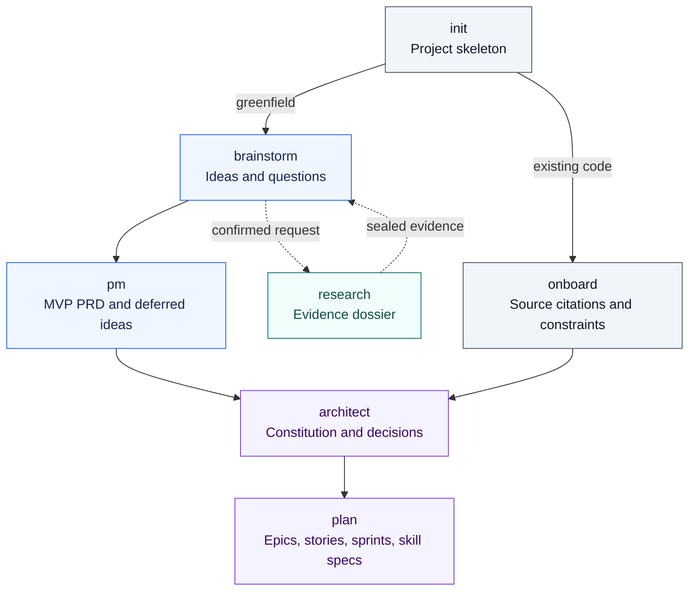
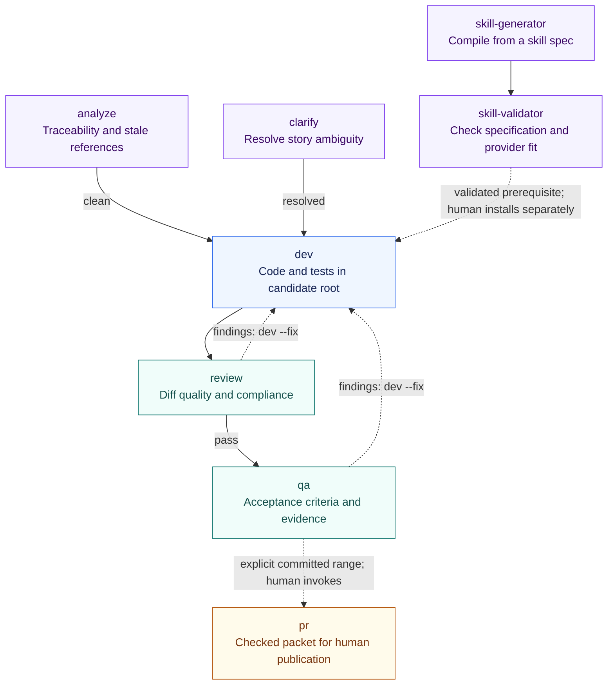
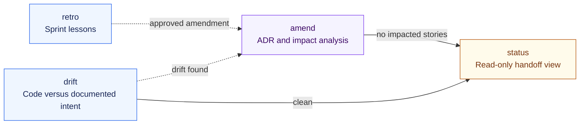

# Skill roster

[Home](../README.md) / Skill roster · [Getting started](getting-started.md) · [Architecture](architecture.md) · [Evidence](evidence.md)

The repository defines **19 skills**. This page groups their designed responsibilities into three readable views; it is not a catalog of 19 installed, live-proven commands. `dev-tdd` is a generated variant of `dev`, not a twentieth skill.

**Read the diagrams as handoffs.** Solid arrows show the principal routes; dashed arrows show conditional routes. A human selects the next invocation after a run closes. Skills do not call other skills or nest runs. The [normative roster](design/02-skill-roster.md) supplies the complete outcome tables and argument grammar.

## 1 · Discover and define

Turn ideas or an existing codebase into explicit requirements, architecture decisions, and bounded work items.

| Skill / persona | Responsibility and output | Specification |
| :--- | :--- | :--- |
| `init` · Installer | Initial state and documentation skeleton; no LLM workers | [004](design/specs/SKILL-SPEC-004-init.md) |
| `onboard` · Archaeologist | Existing-code citations, optional non-derivable OBSERVED constraints, and OBSERVED `stack.yaml` | [005](design/specs/SKILL-SPEC-005-onboard.md) |
| `brainstorm` · Business Analyst | Identified ideas and questions in a brainstorm document | [006](design/specs/SKILL-SPEC-006-brainstorm.md) |
| `research` · Research Lead | Typed evidence, claims, verification, sealed dossier, and a handoff under its separate P0–P9 contract | [018](design/specs/SKILL-SPEC-018-research.md) |
| `pm` · Project Manager | MVP or feature PRD; non-MVP ideas retained in the backlog | [007](design/specs/SKILL-SPEC-007-pm.md) |
| `architect` · Senior Architect | INTENDED constitution, source tree, stack, architecture, design documents, and ADRs | [008](design/specs/SKILL-SPEC-008-architect.md) |
| `plan` · Scrum Master | Epics → stories → skill specs → dependencies → estimates → sprint files | [009](design/specs/SKILL-SPEC-009-plan.md) |

**Ownership is explicit:** architecture records mandates; `plan` owns epic, story, sprint, and skill-spec authoring. Stories carry relevant excerpts with source anchors and hashes. Brownfield onboarding does not require generating an architecture document from facts already derivable from source.

Research can support other phases too, but persistence requires its explicit digest-confirmed request. Provider worker execution remains outside the implemented offline Core. [Research boundary →](../tests/research/README.md)

**Next:** `plan` hands off to traceability analysis, clarification, or missing-skill generation as its outcome requires.

## 2 · Prepare, develop, and verify

Resolve readiness issues before development; separate implementation, code review, acceptance testing, and publication.

| Skill / persona | Responsibility and output | Specification |
| :--- | :--- | :--- |
| `analyze` · Auditor | Traceability report: missing requirements, orphan stories, stale provenance | [011](design/specs/SKILL-SPEC-011-analyze.md) |
| `clarify` · Analyst | Human answers recorded in the story's clarification section | [010](design/specs/SKILL-SPEC-010-clarify.md) |
| `skill-generator` · Toolsmith | Neutral skill and provider adapter candidates from an authored skill spec | [012](design/specs/SKILL-SPEC-012-skill-generator.md) |
| `skill-validator` · Auditor | Specification, constitution, and provider-conformance report | [013](design/specs/SKILL-SPEC-013-skill-validator.md) |
| `dev` · Developer | Fenced code and tests, dev notes, phase receipts, and a promotion handoff | [001](design/specs/SKILL-SPEC-001-dev.md) |
| `review` · Reviewer | Security, style, and constitution-compliance findings on the diff | [002](design/specs/SKILL-SPEC-002-review.md) |
| `qa` · QA Engineer | Acceptance-criterion results and fix guidance | [003](design/specs/SKILL-SPEC-003-qa.md) |
| `pr` · Release Coordinator | Exact-range title/body, publication request, and digest-bound packet; no GitHub mutation | [019](design/specs/SKILL-SPEC-019-pr.md) |

The executable TDD reference runs **red → green → refactor → smoke → review** inside `dev`. Its internal review worker is not the separate `/review` skill. Producers can edit and run granted stack keys; judges return findings without writing files. See [the worker boundary](architecture.md#worker-context-and-write-authority).

The designed `--fix` route exists, but narrowing red's expected failures to only the report's failed criteria is still unimplemented in the reference sequencer. The `pr` packet flow is implemented locally; automatic insertion of `/pr` into earlier handoffs is not. [Implementation limits →](evidence.md)

**Next:** a passing QA outcome points to the next story or sprint retrospective. PR publication requires the separate, explicit human action recorded in its handoff.

## 3 · Maintain and navigate

Keep decisions, implementation, and the user's next action aligned as the project changes.

| Skill / persona | Responsibility and output | Specification |
| :--- | :--- | :--- |
| `retro` · Scrum Master | Sprint lessons, archive, and proposed amendments for human approval | [015](design/specs/SKILL-SPEC-015-retro.md) |
| `amend` · Architect | Changed constitution document, ADR, impact report, and affected-story refresh | [014](design/specs/SKILL-SPEC-014-amend.md) |
| `drift` · Auditor | Report of differences between code and documented intent | [016](design/specs/SKILL-SPEC-016-drift.md) |
| `status` · Read-only utility | Render existing handoff/state; no model workers, new decision, or file writes | [017](design/specs/SKILL-SPEC-017-status.md) |

When an amendment affects stories, its handoff returns the user to planning; it does not silently authorize development against stale context.

## Find the executable boundary

Checked-in neutral capability sources exist for [Research](../framework/skills/research/) and [PR preparation](../framework/skills/pr/), with [Claude](../providers/claude/) and [Codex](../providers/codex/) adapter sources. Other roster entries have specifications and reference registry definitions; their presence is not evidence of installed packages or live acceptance.

Command spelling is provider-specific. For example, persistent Research uses `/research` on Claude and `$research` on Codex, with a request path and confirmed digest. Consult the [dual-target contract](design/04-dual-target.md), not an assumed slash-command equivalent.

**You are here:** workflow design. Next, read [architecture](architecture.md) to understand enforcement or [evidence](evidence.md) to choose what can be tested today.
